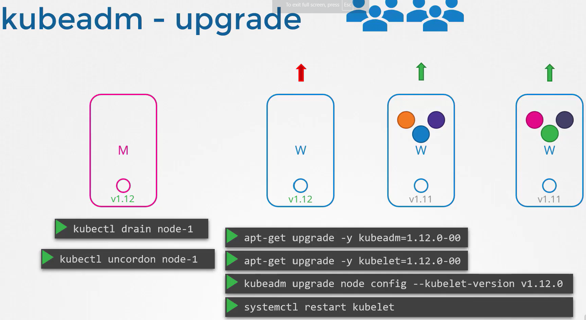

### Kubernetes Upgrade Tutorial: Control Plane and Worker Node to v1.30.0

This tutorial will guide you through upgrading both the **control plane node** (`controlplane`) and a **worker node** (`node01`) to Kubernetes v1.30.0. The steps are outlined for each node, and the slight differences between control plane and worker node upgrades are highlighted. Additional details about the `--ignore-daemonsets` and `--force` options are provided to ensure a smooth process.

#### **Table of Contents**
1. [Upgrade `kubeadm` on the Control Plane Node (`controlplane`)](#1-upgrade-kubeadm-on-the-control-plane-node-controlplane)
2. [Upgrade Control Plane Components (`controlplane`)](#2-upgrade-control-plane-components-controlplane)
3. [Upgrade `kubelet` on the Control Plane Node (`controlplane`)](#3-upgrade-kubelet-on-the-control-plane-node-controlplane)
4. [Upgrade Worker Node (`node01`)](#4-upgrade-worker-node-node01)
   - [Drain the Worker Node (`node01`)](#drain-the-worker-node-node01)
5. [Verification for Both Nodes](#5-verification-for-both-nodes)
6. [Additional Notes on `--ignore-daemonsets` and `--force`](#6-additional-notes-on-ignore-daemonsets-and-force)

---

<div style="text-align: center;">
  
</div>

---


### 1. Upgrade `kubeadm` on the Control Plane Node (`controlplane`)
The first step is to upgrade `kubeadm` on the control plane node. Ensure the Kubernetes APT repository is updated to point to the new version.

1. Open the repository configuration file:
   ```bash
   sudo vim /etc/apt/sources.list.d/kubernetes.list
   ```

2. Update the repository URL to:
   ```bash
   deb [signed-by=/etc/apt/keyrings/kubernetes-apt-keyring.gpg] https://pkgs.k8s.io/core:/stable:/v1.30/deb/ /
   ```

3. Save the file and update the package list:
   ```bash
   sudo apt update
   ```

4. Verify available versions:
   ```bash
   sudo apt-cache madison kubeadm
   ```

5. Install `kubeadm` v1.30.0:
   ```bash
   sudo apt-get install kubeadm=1.30.0-1.1
   ```

[Back to Table of Contents](#table-of-contents)

---

### 2. Upgrade Control Plane Components (`controlplane`)
After upgrading `kubeadm`, upgrade the control plane components (API Server, Controller Manager, Scheduler).

1. Plan the upgrade:
   ```bash
   sudo kubeadm upgrade plan v1.30.0
   ```

2. Apply the upgrade:
   ```bash
   sudo kubeadm upgrade apply v1.30.0
   ```

This upgrades the API Server, Controller Manager, and Scheduler to version 1.30.0.

[Back to Table of Contents](#table-of-contents)

---

### 3. Upgrade `kubelet` on the Control Plane Node (`controlplane`)
Now that the control plane components are upgraded, you need to upgrade the `kubelet`.

1. Install the new `kubelet` version:
   ```bash
   sudo apt-get install kubelet=1.30.0-1.1
   ```

2. Reload systemd and restart `kubelet`:
   ```bash
   sudo systemctl daemon-reload
   sudo systemctl restart kubelet
   ```

[Back to Table of Contents](#table-of-contents)

---

### 4. Upgrade Worker Node (`node01`)
The process for upgrading the worker node (`node01`) is similar, except that the control plane components are not involved.

#### Step 1: Upgrade `kubeadm` on Worker Node
1. Open the repository configuration file:
   ```bash
   sudo vim /etc/apt/sources.list.d/kubernetes.list
   ```

2. Ensure the repository URL is updated:
   ```bash
   deb [signed-by=/etc/apt/keyrings/kubernetes-apt-keyring.gpg] https://pkgs.k8s.io/core:/stable:/v1.30/deb/ /
   ```

3. Update the package list:
   ```bash
   sudo apt update
   ```

4. Verify the available versions:
   ```bash
   sudo apt-cache madison kubeadm
   ```

5. Install `kubeadm` v1.30.0:
   ```bash
   sudo apt-get install kubeadm=1.30.0-1.1
   ```

---

#### Drain the Worker Node (`node01`)
Before upgrading the worker node, drain it to prevent new workloads from being scheduled during the upgrade:

```bash
kubectl drain node01 --ignore-daemonsets
```

- `--ignore-daemonsets`: This flag ensures that daemonsets (such as logging or monitoring agents) are not affected when draining the node.
- `--force`: This option can be used if you want to forcefully evict workloads (such as unmanaged pods) during the drain.

> **Note**: Use `--force` with caution as it forcefully removes pods that don’t have graceful shutdown settings, potentially disrupting your applications.

---

#### Step 2: Upgrade the Kubelet on Worker Node
Once `kubeadm` is upgraded, you can now upgrade `kubelet` and restart it:

1. Upgrade `kubeadm` components:
   ```bash
   sudo kubeadm upgrade node
   ```

2. Install the new version of `kubelet`:
   ```bash
   sudo apt-get install kubelet=1.30.0-1.1
   ```

3. Reload systemd and restart `kubelet`:
   ```bash
   sudo systemctl daemon-reload
   sudo systemctl restart kubelet
   ```

---

#### Step 3: Mark Node as Schedulable
Once the worker node (`node01`) is upgraded, mark it as schedulable again:

```bash
kubectl uncordon node01
```

This command allows new pods to be scheduled on the node.

[Back to Table of Contents](#table-of-contents)

---

### 5. Verification for Both Nodes

#### **Check Node Version**
To confirm the upgrade of both the control plane node and worker node, run:

```bash
kubectl get nodes
```

**Sample output**:

```bash
NAME           STATUS   ROLES           AGE     VERSION
controlplane   Ready    control-plane   100d    v1.30.0
node01         Ready    <none>          50d     v1.30.0
```

This confirms both nodes are running Kubernetes version `v1.30.0`.

#### **Check Kubelet Version**
On each node (`controlplane` and `node01`), verify the `kubelet` version:

```bash
kubelet --version
```

**Sample output**:

```bash
Kubernetes v1.30.0
```

#### **Check Control Plane Version**
On the control plane node (`controlplane`), check the control plane components (API Server, Controller Manager, Scheduler):

```bash
kubectl version --short
```

**Sample output**:

```bash
Client Version: v1.30.0
Kubelet Version: v1.30.0
Server Version: v1.30.0
```

[Back to Table of Contents](#table-of-contents)

---

### 6. Additional Notes on `--ignore-daemonsets` and `--force`

- **`--ignore-daemonsets`**: This option is useful when draining a node. It ensures that **DaemonSet-managed pods** (like monitoring agents, logging agents) are not disrupted during the node drain. DaemonSet pods are usually critical to the cluster, so ignoring them ensures minimal disruption.

- **`--force`**: This flag allows you to force the eviction of pods that cannot be drained normally (e.g., unmanaged or misconfigured pods without a proper termination grace period). Use this option with caution as it can forcefully remove essential pods, potentially causing application downtime. Pods that aren't controlled by ReplicaController, ReplicaSet, Deployment, job etc give an error when being drained as they can't be recreated automatically and will be lost forever if drained. Using the `--force` option drains them as well.

[Back to Table of Contents](#table-of-contents)

---

This concludes the tutorial on upgrading both the **control plane node** (`controlplane`) and the **worker node** (`node01`) to Kubernetes version `v1.30.0`.
