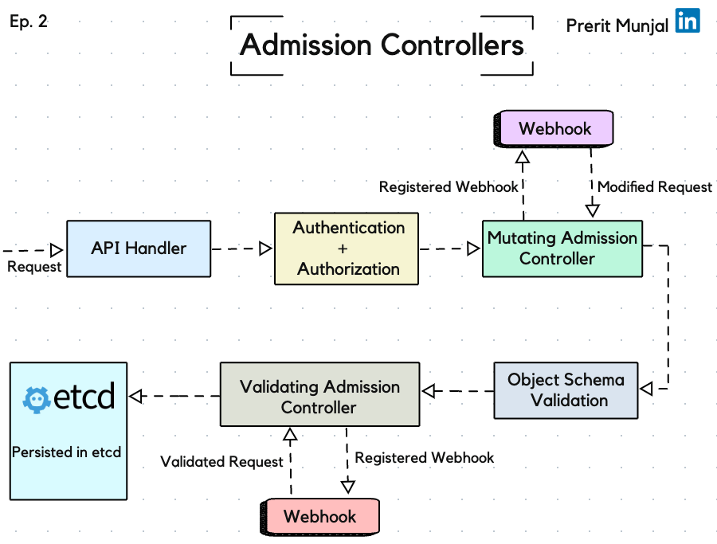

<div style="text-align: center;">
  
</div>

# Admission Controllers in Kubernetes

## Table of Contents

1. [Introduction](#introduction)
2. [Importance of Admission Controllers](#importance-of-admission-controllers)
3. [How Admission Controllers Work](#how-admission-controllers-work)
4. [Step-by-Step Process](#step-by-step-process)
5. [Mutating Admission Controllers](#mutating-admission-controllers)
6. [Validating Admission Controllers](#validating-admission-controllers)
7. [Combining Mutating and Validating Controllers](#combining-mutating-and-validating-controllers)
8. [Implementation Steps](#implementation-steps)
9. [Object Schema Validation](#object-schema-validation)
10. [Real-World Use Cases](#real-world-use-cases)
11. [Advanced Use Cases](#advanced-use-cases)
12. [CRD: Custom Resource Definitions](#crd-custom-resource-definitions)
13. [Checking Enabled Admission Controllers](#checking-enabled-admission-controllers)
14. [Conclusion](#conclusion)

## Introduction

In Kubernetes, Admission Controllers are essential components that govern and enforce certain rules and policies on the incoming API requests. They act as gatekeepers, ensuring that the cluster operates efficiently and securely. There are two main types of Admission Controllers:

1. **Mutating Admission Controllers**: These can alter the incoming request before it is persisted.
2. **Validating Admission Controllers**: These ensure that the incoming request adheres to the set policies and rules without modifying it.

## Importance of Admission Controllers

The Mutating Admission Controllers are particularly critical as they have the power to change configurations. This makes them potentially dangerous if not handled correctly, as they can cause significant disruptions if they introduce incorrect changes. The Validating Admission Controllers, on the other hand, play a crucial role in ensuring the integrity and compliance of the incoming requests.

## How Admission Controllers Work

Once a request/API call is authenticated and authorized, it is sent to the Admission Controller, which intercepts the request before making any solid changes in the cluster. The entire process happens in two phases:

1. **Mutating Phase**:
   - In this phase, the Mutating Admission Controllers perform changes on objects if specified. For example, the `DefaultIngressClass` will add an ingress class to the Ingress objects.

2. **Validating Phase**:
   - After the mutation, the Validating Admission Controllers validate the request. For example, `NamespaceExists` will check if the namespace exists or not.

First, the mutating admission controllers are run, followed by the validating admission controllers. If any of them reject the request, the error is reported to the API server and an error is returned to the end user.

## Step-by-Step Process

### 1. Request Handling
The process begins with the API Handler, which receives the request from the user.

### 2. Authentication and Authorization
The request is authenticated and authorized to ensure it is coming from a legitimate source with appropriate permissions.

### 3. Mutating Admission Controller
The request is then passed to the Mutating Admission Controller. If any mutations are required, such as adding a default ingress class, they are performed here.

### 4. Object Schema Validation
After the mutation, the request goes through Object Schema Validation to ensure the configuration is correct and adheres to the schema definitions.

### 5. Validating Admission Controller
The validated request is then passed to the Validating Admission Controller to ensure all policies and rules are followed.

### 6. Final Validation and Persistence
Once validated, the request is finally persisted in the etcd database, and the relevant API calls are made to the necessary components to apply the changes.

## Mutating Admission Controllers

Mutating Admission Controllers are responsible for modifying the incoming requests to match the policies set by the administrators. This can include adding default values, modifying existing values, or even rejecting requests that don't meet certain criteria.

### Example:
- **Memory Allocation**:
  - If a pod requests 1GB of storage, but the company's policy only allows 800MB, the Mutating Admission Controller can modify this request to fit within the allowed limits before it proceeds further.

### Commands to Check Mutating Controllers:
```sh
kubectl get apiservices
cd /etc/kubernetes/manifests
cat kube-apiserver.yaml | grep admission
```

### Example YAML for Mutating Webhook:
```yaml
apiVersion: admissionregistration.k8s.io/v1
kind: MutatingWebhookConfiguration
metadata:
  name: memory-limiter
webhooks:
- name: memory-limiter.k8s.io
  clientConfig:
    service:
      name: memory-limiter
      namespace: default
      path: "/mutate"
    caBundle: ...
  rules:
  - operations: ["CREATE"]
    apiGroups: [""]
    apiVersions: ["v1"]
    resources: ["pods"]
  admissionReviewVersions: ["v1", "v1beta1"]
  sideEffects: None
```

## Validating Admission Controllers

Validating Admission Controllers ensure that the incoming requests meet the predefined policies and rules. They do not modify the requests but can reject them if they don't comply with the requirements.

### Example:
- **Namespace Check**:
  - The `NamespaceExists` controller checks if the requested namespace exists. If not, it rejects the request.

### Commands to Check Validating Controllers:
```sh
kubectl get apiservices
cd /etc/kubernetes/manifests
cat kube-apiserver.yaml | grep admission
```

### Example YAML for Validating Webhook:
```yaml
apiVersion: admissionregistration.k8s.io/v1
kind: ValidatingWebhookConfiguration
metadata:
  name: pod-validator
webhooks:
- name: pod-validator.k8s.io
  clientConfig:
    service:
      name: pod-validator
      namespace: default
      path: "/validate"
    caBundle: ...
  rules:
  - operations: ["CREATE", "UPDATE"]
    apiGroups: [""]
    apiVersions: ["v1"]
    resources: ["pods"]
  admissionReviewVersions: ["v1", "v1beta1"]
  sideEffects: None
```

## Combining Mutating and Validating Controllers

Some Admission Controllers can perform both mutation and validation, ensuring the requests are both modified appropriately and validated against the policies.

### Example:
- **LimitRanger**:
  - This controller observes incoming requests and ensures they do not violate any limit range values defined in the namespace, setting default values to the objects as needed.

### Example YAML for Combined Webhook:
```yaml
apiVersion: admissionregistration.k8s.io/v1
kind: ValidatingWebhookConfiguration
metadata:
  name: limit-ranger
webhooks:
- name: limit-ranger.k8s.io
  clientConfig:
    service:
      name: limit-ranger
      namespace: default
      path: "/validate"
    caBundle: ...
  rules:
  - operations: ["CREATE", "UPDATE"]
    apiGroups: [""]
    apiVersions: ["v1"]
    resources: ["pods"]
  admissionReviewVersions: ["v1", "v1beta1"]
  sideEffects: None
```

## Implementation Steps

### Check Default Controllers
Kubernetes comes with some predefined Admission Controllers. You can check which ones are enabled by default using the following commands:
```sh
kubectl get apiservices
cd /etc/kubernetes/manifests
cat kube-apiserver.yaml | grep admission
```

### Mutating Webhooks
For more advanced use cases, you can create custom mutating webhooks that automatically adjust configurations.

```yaml
apiVersion: admissionregistration.k8s.io/v1
kind: MutatingWebhookConfiguration
metadata:
  name: memory-limiter
webhooks:
- name: memory-limiter.k8s.io
  clientConfig:
    service:
      name: memory-limiter
      namespace: default
      path: "/mutate"
    caBundle: ...
  rules:
  - operations: ["CREATE"]
    apiGroups: [""]
    apiVersions: ["v1"]
    resources: ["pods"]
  admissionReviewVersions: ["v1", "v1beta1"]
  sideEffects: None
```

### Validating Webhooks
Similarly, you can create validating webhooks that enforce policies.

```yaml
apiVersion: admissionregistration.k8s.io/v1
kind: ValidatingWebhookConfiguration
metadata:
  name: pod-validator
webhooks:
- name: pod-validator.k8s.io
  clientConfig:
    service:
      name: pod-validator
      namespace: default
      path: "/validate"
    caBundle: ...
  rules:
  - operations: ["CREATE", "UPDATE"]
    apiGroups: [""]
    apiVersions: ["v1"]
    resources: ["pods"]
  admissionReviewVersions: ["v1", "v1beta1"]
  sideEffects: None
```

## Object Schema Validation

### YAML Example
To ensure that the configuration files are valid, you can use schema validation.

#### Example YAML for Object Schema Validation:
```yaml
apiVersion: apiextensions.k8s.io/v1
kind: CustomResourceDefinition
metadata:
  name: cronjobs.batch.tutorial.k8s.io
spec:
  group: tutorial.k8s.io
  versions:
    - name: v1
      served: true
      storage: true
      schema:
        openAPIV3Schema:
          type: object
          properties:
            spec:
              type: object
              properties:
                cronSpec:
                  type: string
                image:
                  type: string
                replicas:
                  type: integer
  scope: Namespaced
  names:
    plural: cronjobs
    singular: cronjob
    kind: CronJob
    shortNames:
    - cj


```

In this example, the `CustomResourceDefinition` defines a schema for a `CronJob` object. The schema specifies that the `spec` field must be an object containing a `cronSpec` string, an `image` string, and a `replicas` integer.

### Why Schema Validation?
Schema validation is critical because it ensures that the resources are created with valid configurations, reducing errors and misconfigurations in the cluster. By defining a schema, you can enforce consistent configurations and prevent invalid data from being persisted.

## Real-World Use Cases

1. **Blocking the Use of Public Registries**:
   - Prevent the deployment of containers from public registries to enforce security policies.

2. **Restricting Actions on Objects**:
   - Limit the actions like get, and list on specific objects to enforce data access policies.

3. **Enforcing Security Policies on Pods**:
   - Ensure that all pods comply with the organization's security standards by validating their configurations.

### Example:
- **Memory Allocation**:
  - If a pod requests 1GB of storage, but the company's policy only allows 800MB, the Mutating Admission Controller can modify this request to fit within the allowed limits before it proceeds further.

## Advanced Use Cases

### Custom Resource Definitions (CRDs)
CRDs allow you to extend Kubernetes by defining your own object types.

#### Example:
- **Custom Resource Definition (CRD)**:
  - If you want to define a new resource type called `Application`, you can create a CRD for it.

```yaml
apiVersion: apiextensions.k8s.io/v1
kind: CustomResourceDefinition
metadata:
  name: applications.mycompany.com
spec:
  group: mycompany.com
  versions:
    - name: v1
      served: true
      storage: true
  scope: Namespaced
  names:
    plural: applications
    singular: application
    kind: Application
```

### Checking Enabled Admission Controllers

To check which Admission Controllers are enabled in your cluster, use the following command:

```sh
kubectl get apiservices
cd /etc/kubernetes/manifests
ls -l /etc/kubernetes/manifests
cat kube-apiserver.yaml | grep admission
```

### Example Output:
```sh
total 8
-rw-r--r-- 1 root root 1336 Jul  1 12:34 etcd.yaml
-rw-r--r-- 1 root root 2675 Jul  1 12:34 kube-apiserver.yaml
-rw-r--r-- 1 root root 2240 Jul  1 12:34 kube-controller-manager.yaml
-rw-r--r-- 1 root root 1573 Jul  1 12:34 kube-scheduler.yaml
```

## Conclusion

Admission Controllers are crucial in Kubernetes for ensuring that the cluster operates securely and efficiently. By understanding and implementing both Mutating and Validating Admission Controllers, you can enforce policies, automate configurations, and prevent potential issues in your Kubernetes clusters. This knowledge is vital for both day-to-day operations and during technical interviews, where you might be asked to explain or implement such controllers.
