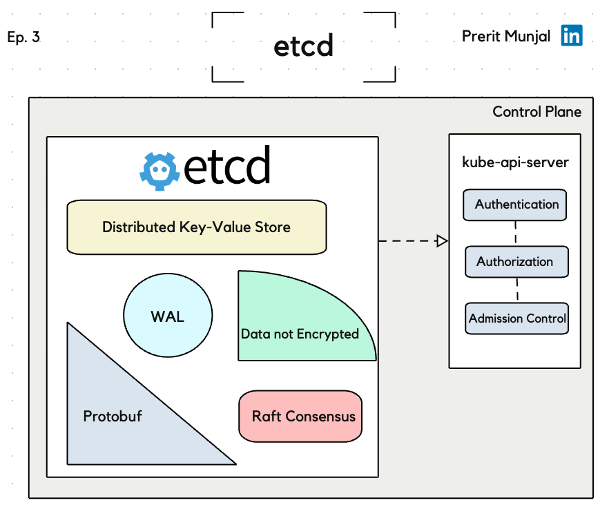

## Comprehensive Tutorial on etcd

### Table of Contents
1. [Introduction](#introduction)
2. [Key Features of etcd](#key-features-of-etcd)
3. [Detailed Breakdown of etcd Components](#detailed-breakdown-of-etcd-components)
   - [Distributed Key-Value Store](#1-distributed-key-value-store)
   - [Write Ahead Log (WAL)](#2-write-ahead-log-wal)
   - [Raft Consensus](#3-raft-consensus)
   - [Data Not Encrypted](#4-data-not-encrypted)
   - [Protobuf](#5-protobuf)
4. [How etcd Works with Kubernetes](#how-etcd-works-with-kubernetes)
5. [Raft Election Process](#raft-election-process)
6. [Number of Nodes and Quorum](#number-of-nodes-and-quorum)
7. [Visualization and Deep Dive](#visualization-and-deep-dive)
8. [Practical Insights](#practical-insights)
9. [Conclusion](#conclusion)
10. [Additional Resources](#additional-resources)

### Introduction
etcd is a distributed, highly consistent key-value store that plays a crucial role in Kubernetes (k8s) as the only stateful component. The name etcd is derived from “etc,” which is the location of system configuration files in Linux, and “d” stands for distributed.

  

### Key Features of etcd
1. **Distributed Key-Value Store**: etcd is not just an ordinary database. It is a distributed, highly consistent key-value store essential for maintaining the state of a Kubernetes cluster. **etcd is a NoSQL database**, which means it does not use the traditional table-based relational database structure that SQL databases use. Instead, it stores data in a simple key-value format.
2. **Raft Consensus Algorithm**: etcd is built on the Raft consensus algorithm, ensuring that all nodes hold elections, and the one with the majority becomes the leader, while others become followers. **The leader first receives the data and then replicates it across all the followers. Once all nodes have the same data, the log is committed.**
3. **Protobuf Serialization**: etcd uses Protobuf for faster serialization and deserialization of data.
4. **Data Not Encrypted by Default**: By default, the data stored in etcd is not encrypted, but it can be encrypted if required.
5. **Stores Critical Data**: etcd stores all the data related to the current state, cluster information, desired state, and runtime data.
6. **Write Ahead Log (WAL)**: etcd uses WAL, meaning operations are logged before they happen to ensure high consistency and data integrity.
7. **Multi-Version Key-Value Model**: Data is stored in a multi-version key-value model where keys store values and their subsequent revisions or versions.
8. **High Throughput with Low CPU Pressure and Latency**: By clubbing together a couple of entries and sending them to the engine, etcd achieves high throughput despite heavy load.

### Detailed Breakdown of etcd Components
The image provided breaks down etcd into several components, each playing a vital role in its functionality. Here’s a detailed explanation of these components:

#### 1. Distributed Key-Value Store
etcd functions as a distributed key-value store, making it ideal for maintaining the state and configuration of distributed systems like Kubernetes. As a NoSQL database, etcd does not rely on relational table-based structures but instead uses a simple key-value format for storing data.

#### 2. Write Ahead Log (WAL)
**WAL ensures that all operations are logged before they are executed, providing a mechanism for data recovery and maintaining consistency in case of failures.**

**How WAL Works:**
1. **Logging Operations**: Before any transaction is applied to the database, it is first recorded in the WAL. This includes all changes and updates to the data.
2. **Sequential Writes**: The WAL is designed to write operations sequentially. This approach is efficient and ensures that the log is always up-to-date with the latest operations.
3. **Durability and Recovery**: In the event of a failure (such as a system crash or power outage), the WAL allows the system to recover by replaying the logged operations. This ensures that no data is lost and the database remains consistent.
4. **Commit Process**: Once an operation is logged in the WAL, it can then be applied to the database. The database will read the log and apply the changes, ensuring that the actual data is updated accordingly.

**Writing Data to Disk:**
1. **RAM Buffer**: Initially, the data is written to a RAM buffer. This is a temporary storage area that allows for fast access and writing.
2. **OS Buffer**: The data then moves from the RAM buffer to the operating system (OS) buffer. This step involves the OS managing the data before it is written to disk.
3. **Disk Cache**: Next, the data is written to the disk cache. The disk cache is a smaller, faster storage area on the disk itself that holds data temporarily before it is permanently written to the disk.
4. **Disk**: Finally, the data is written to the actual disk. This step ensures that the data is persistently stored.

This multi-step process is designed to optimize performance and ensure data integrity. By using buffers and caches, the system can handle high write frequencies and ensure that data is not lost in the event of a failure.

#### 3. Raft Consensus
The Raft consensus algorithm is the backbone of etcd’s consistency model. **It involves leader election and log replication. When a leader node is elected, it replicates data to follower nodes, ensuring all nodes have the same data before committing the log.**

#### 4. Data Not Encrypted
By default, the data in etcd is not encrypted, which means anyone with access to etcd can read the data. However, encryption can be enabled for added security.

#### 5. Protobuf
Protobuf is used for serialization and deserialization of data, enhancing performance due to its efficiency compared to JSON.

### How etcd Works with Kubernetes
etcd is a core component of Kubernetes' control plane, interfacing with the kube-api-server for:
- **Authentication**
- **Authorization**
- **Admission Control**

The kube-api-server interacts with etcd to store and retrieve the cluster’s state and configuration.

### Raft Election Process
The Raft consensus algorithm is a fundamental part of etcd, ensuring data consistency and reliability across distributed systems. Here's a detailed explanation of the Raft election process, including the election timeout, heartbeat, and the steps that occur during this process.

#### Raft Consensus Overview
Raft is a consensus algorithm designed to manage a replicated log. It is used to ensure that distributed systems agree on a common state, even in the presence of network partitions or node failures. Raft breaks down the consensus process into three key roles:
- **Leader**
- **Candidate**
- **Follower**

Only one node can be the leader at any time, while the other nodes act as followers. If the leader fails, a new leader is elected through a process called leader election.

#### Election Process
The election process in Raft involves several steps to ensure a new leader is chosen when necessary. Here's a detailed breakdown of the process:

1. **Initial State**:
   - All nodes start as followers. A follower node transitions to a candidate state if it does not hear from a leader within an election timeout.

2. **Election Timeout**:
   - **Election Timeout**: The election timeout is a random duration between 150ms and 300ms. If a follower does not receive a heartbeat from the leader within this time, it assumes the leader has failed and becomes a candidate.
   - The randomness in the timeout helps to avoid split votes where multiple candidates simultaneously request votes.

3. **Candidate State**:
   - **Request Votes**: When a follower becomes a candidate, it increments its term and sends a request for votes to all other nodes in the cluster.
   - **Voting**: Each node responds to the request. Nodes can vote for at most one candidate in a given term. If a candidate receives votes from a majority of the nodes, it becomes the leader.
   - **Split Vote**: If there is a split vote (no candidate receives a majority), the election times out, and a new election begins. This process repeats until a candidate wins a majority.

4. **Leader State**:
   - Once elected, the leader starts sending heartbeats (AppendEntries RPCs) to all followers to assert its leadership and prevent new elections.
   - **Heartbeat Timeout**: The leader sends heartbeats at regular intervals (much shorter than the election timeout) to ensure that followers do not time out and start new elections.

5. **Heartbeat and Log Replication**:
   - **Heartbeats**: The leader periodically sends heartbeats to all followers to maintain its authority. This prevents the followers from becoming candidates.
   - **Log Replication**: When a client sends a request to change the system’s state, the leader appends the request to its log and sends it to the followers. Once a majority of followers have written the entry to their logs, the leader applies the entry to its state machine and responds to the client.

6. **Failure Handling**:
   - **Leader Failure**: If a leader fails, followers will no longer receive heartbeats. After an election timeout, the followers will transition to candidates and start a new election.
   - **Candidate Failure**: If a candidate fails to win an election, it returns to the follower state and waits for the next election timeout.
   - **Network Partitions**: In the event of a network partition, some nodes may become isolated. These nodes will not receive heartbeats and will start

 an election. If the partitioned nodes form a majority, they will elect a new leader. When the partition heals, the old leader will step down if it discovers a higher term leader.

### Number of Nodes and Quorum
When configuring an etcd cluster, it's essential to choose the right number of nodes to ensure high availability and fault tolerance. The optimal number of nodes is always an odd number. Here’s a detailed explanation:

#### Why Use an Odd Number of Nodes?
Using an odd number of nodes ensures that the cluster can achieve quorum (a majority) even when some nodes fail. Quorum is the minimum number of votes needed to make the cluster operational and to reach consensus.

#### Formula for Quorum
The formula to determine the quorum is:
\[ \text{Quorum} = \left(\frac{N}{2}\right) + 1 \]

Where \( N \) is the total number of nodes in the cluster. This ensures that the cluster can tolerate up to \(\left(\frac{N - 1}{2}\right)\) node failures.

#### Fault Tolerance
Fault tolerance refers to the cluster’s ability to continue functioning correctly even when some nodes fail. The number of nodes that can fail while still maintaining quorum is given by:
\[ \text{Fault Tolerance} = \left(\frac{N - 1}{2}\right) \]

This means that if the number of node failures is less than or equal to the fault tolerance, the cluster can still reach quorum and function correctly.

#### Examples:
1. **3 Nodes**:
   - **Quorum Calculation**:
     \[ \text{Quorum} = \left(\frac{3}{2}\right) + 1 = 2 \]
     (since \( \frac{3}{2} = 1.5 \), rounded up to 2)
   - **Fault Tolerance Calculation**:
     \[ \text{Fault Tolerance} = \left(\frac{3 - 1}{2}\right) = 1 \]
   - **Explanation**:
     - With 3 nodes, at least 2 nodes need to be operational to reach quorum.
     - The cluster can tolerate 1 node failure (because with 2 nodes left, quorum can still be achieved).

2. **5 Nodes**:
   - **Quorum Calculation**:
     \[ \text{Quorum} = \left(\frac{5}{2}\right) + 1 = 3 \]
     (since \( \frac{5}{2} = 2.5 \), rounded up to 3)
   - **Fault Tolerance Calculation**:
     \[ \text{Fault Tolerance} = \left(\frac{5 - 1}{2}\right) = 2 \]
   - **Explanation**:
     - With 5 nodes, at least 3 nodes need to be operational to reach quorum.
     - The cluster can tolerate 2 node failures (because with 3 nodes left, quorum can still be achieved).

3. **7 Nodes**:
   - **Quorum Calculation**:
     \[ \text{Quorum} = \left(\frac{7}{2}\right) + 1 = 4 \]
     (since \( \frac{7}{2} = 3.5 \), rounded up to 4)
   - **Fault Tolerance Calculation**:
     \[ \text{Fault Tolerance} = \left(\frac{7 - 1}{2}\right) = 3 \]
   - **Explanation**:
     - With 7 nodes, at least 4 nodes need to be operational to reach quorum.
     - The cluster can tolerate 3 node failures (because with 4 nodes left, quorum can still be achieved).

### Key Points:
- **Odd Number of Nodes**: Using an odd number of nodes ensures that the cluster can always achieve a majority (quorum) even if some nodes fail.
- **Quorum**: More than half of the total nodes need to be operational to maintain the cluster’s functionality.
- **Fault Tolerance**: The number of nodes that can fail while still maintaining quorum is \(\left(\frac{N - 1}{2}\right)\).

By configuring the cluster with an appropriate number of nodes and understanding the relationship between fault tolerance and quorum, you can ensure that the etcd cluster remains highly available and consistent, even in the presence of node failures.

### Visualization and Deep Dive
For a visual representation of the Raft consensus and election process in etcd, refer to "The Secrets of Raft" at dataprocessing.com. This site provides excellent visual aids for understanding how leader elections and log replication work in etcd.

### Practical Insights
Understanding the inner workings of etcd is crucial for clearing interviews, especially for roles that involve managing Kubernetes clusters. **Knowledge of distributed consensus, the role of WAL, and the importance of Raft consensus in ensuring data consistency can set you apart in technical interviews.**

### Conclusion
**etcd is a robust, highly consistent key-value store essential for Kubernetes.** Its reliance on the Raft consensus algorithm ensures data integrity and consistency across distributed systems. Understanding its components, working mechanisms, and interaction with Kubernetes is vital for anyone working with or managing Kubernetes clusters.

### Additional Resources
To delve deeper into etcd, visit the official etcd documentation and explore resources like "The Secrets of Raft" for a comprehensive understanding of its underlying mechanisms and functionalities.

---

Feel free to ask for any specific details or further elaboration on any of the topics covered in this tutorial.
