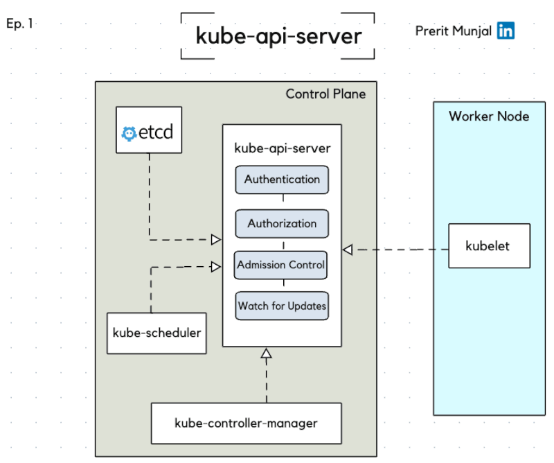

# Kubernetes API Server Tutorial

## Table of Contents
1. [Introduction to Kubernetes API Server](#introduction-to-kubernetes-api-server)
2. [Main Functions of Kube-API Server](#main-functions-of-kube-api-server)
   - [Authentication](#authentication)
   - [Authorization](#authorization)
   - [Admission Control](#admission-control)
   - [Watch for Updates](#watch-for-updates)
3. [Why is the kube-apiserver so Important?](#why-is-the-kube-apiserver-so-important)
4. [Real-life Production Use Case](#real-life-production-use-case)
5. [Conclusion](#conclusion)

## Introduction to Kubernetes API Server

The Kubernetes API Server is the most critical component of your Kubernetes cluster. If the kube-apiserver goes down, the entire cluster goes down, and no activity can be performed.

This is a common interview question: "If the master node goes down and the application is already deployed, will the application continue to run?" The answer is: Yes, the application will continue to run because it is deployed on the worker nodes. The master node is only for management purposes. You won't be able to update or make changes, but the application will keep running as is.

## Main Functions of Kube-API Server

  

### Authentication

- **Purpose**: To confirm the identity of a user or service accessing the cluster.
- **Methods**:
  - **Bearer Tokens**: Tokens are used to authenticate requests. They are usually sent in the HTTP headers.
  - **Certificates**: These are digital certificates that prove the identity of the user or service.

Think of authentication as a security guard at the entrance of a school, checking IDs to ensure only authorized individuals enter.

### Authorization

- **Purpose**: To determine if the authenticated user has permission to perform the requested action.
- **RBAC (Role-Based Access Control)**: This method assigns roles to users, and each role has specific permissions.
  - For example, a CTO might have the permission to create and manage clusters, while an intern might only have read-only access.

Authorization is like a class monitor who ensures students only attend the classes they are enrolled in.

### Admission Control

- **Purpose**: To enforce policies on the requests after they have been authenticated and authorized.
- **Types**:
  - **Mutating Admission Controllers**: These controllers can modify the requests to ensure they meet certain criteria.
  - **Validating Admission Controllers**: These controllers check if the requests comply with the policies.

Imagine admission control as the final check before a student is allowed to attend a class, ensuring they meet all the prerequisites.

### Watch for Updates

- **Purpose**: To provide low-latency updates to clients instead of having them poll the server frequently for updates.
- **Watch API**: Kubernetes supports the Watch API, which allows clients to receive updates in real-time. This reduces the load on the server and provides a more efficient way to track changes in the cluster.

The Watch API is like subscribing to a live news feed instead of refreshing a webpage repeatedly to check for new updates.

## Why is the kube-apiserver so Important?

1. **Logs Everything**: The kube-apiserver logs all activities in audit and basic logs. It serves as a middle ground for all the components of a cluster to meet and fetch requests.
2. **Manages API Calls**: Kubernetes is built around APIs, and the kube-apiserver plays a crucial role in API discovery and API translation.
3. **Authentication**: As soon as a request/API call reaches the server, it checks for the authenticity of the request using client certificates and tokens.
4. **Authorization**: Once the identity is determined, it performs authorization using RBAC, Webhook, Node, or ABAC.
5. **Admission Control**: After authentication and authorization, admission controllers check and validate the request. If any admission controller finds an error, the request is rejected.
6. **Supports the Watch API**: Instead of polling the server frequently for updates, it uses low-latency updates known as Watch.

## Real-life Production Use Case

In a real-life production environment, admission controllers are crucial. They ensure that every request complies with the organization’s policies and can modify requests if necessary. This helps maintain security, consistency, and compliance within the Kubernetes cluster.

## Conclusion

Understanding the Kubernetes API Server's functions is essential for managing and maintaining a healthy Kubernetes cluster. Authentication, authorization, admission control, and the Watch API are key processes that ensure the security and integrity of the cluster.

For job interviews, be prepared to answer questions about what happens if the kube-apiserver or master node goes down. Understanding these concepts will help you explain the high availability and robustness of Kubernetes applications.

By mastering these concepts, you will be better equipped to handle Kubernetes clusters in a production environment and excel in related job interviews.
