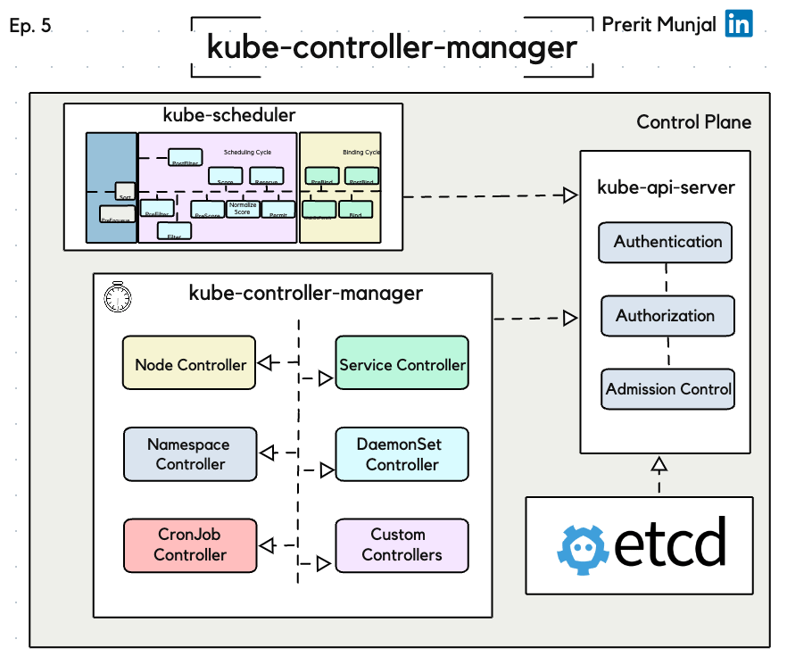

### Comprehensive Tutorial: Understanding kube-controller-manager

#### Table of Contents

1. [Introduction](#introduction)
2. [Workflow Before `kube-controller-manager`](#workflow-before-kube-controller-manager)
3. [Role of `kube-controller-manager`](#role-of-kube-controller-manager)
   - [Observer-Compare-Action](#observer-compare-action)
   - [SharedInformer](#sharedinformer)
   - [WorkQueue](#workqueue)
4. [Built-in Kubernetes Controllers](#built-in-kubernetes-controllers)
   - [Node Controller](#node-controller)
   - [Service Controller](#service-controller)
5. [Internal Mechanisms](#internal-mechanisms)
   - [Node Eviction](#node-eviction)
   - [Cron Jobs](#cron-jobs)
   - [Custom Controllers and Daemon Sets](#custom-controllers-and-daemon-sets)
6. [Example Process Flow](#example-process-flow)
7. [Conclusion](#conclusion)

---

#### Introduction

In Kubernetes, the `kube-controller-manager` plays a crucial role in maintaining the desired state of the cluster. It ensures that the actual state of resources matches the desired state defined by the user.

  

#### Workflow Before `kube-controller-manager`

Before the `kube-controller-manager` comes into play, a series of steps are performed on any request:

1. **Authenticated & Authorized:** The request is authenticated and authorized to ensure it has the necessary permissions.
2. **Passed by the Admission Controllers:** The request is then evaluated by admission controllers for additional checks and transformations.
3. **Persisted in etcd:** Once approved, the request is persisted in `etcd`, the key-value store used by Kubernetes.
4. **Scheduled:** The `kube-scheduler` assigns the request to the appropriate node, ensuring it gets the green flag from all plugins involved.

#### Role of `kube-controller-manager`

After these preliminary steps, the `kube-controller-manager` takes over to ensure that the desired state (.spec) and the current state (.status) of the cluster resources are synchronized.

##### Observer-Compare-Action

This daemon continuously polls the API Server to check the state of various resources. It observes the current state, compares it with the desired state, and takes action if discrepancies are found. This cycle repeats indefinitely.

##### SharedInformer

To optimize performance and reduce latency, `SharedInformer` is used. This creates a single watch state on the API Server which can be consumed by multiple controllers, thus reducing CPU pressure and avoiding redundant API calls.

##### WorkQueue

Tasks are sent to a queue, where they are processed one at a time. This ensures efficient management and execution of tasks, preventing overload.

#### Built-in Kubernetes Controllers

Several built-in controllers handle different aspects of cluster management:

##### Node Controller

Manages worker nodes based on metrics provided by `kubelet`. It ensures nodes are healthy and replaces unhealthy nodes with healthy ones.

##### Service Controller

Configures and manages services within the cluster. It ensures that services are correctly defined and available.

#### Internal Mechanisms

##### Node Eviction

If a node is found unhealthy, it is evicted and replaced by a healthy one. This is a high-level mechanism to maintain cluster integrity.

##### Cron Jobs

Automates tasks to run at specified times, ensuring periodic tasks are managed without manual intervention.

##### Custom Controllers and Daemon Sets

These handle specific tasks and configurations, ensuring custom requirements and background processes are managed efficiently.

#### Example Process Flow

1. **Observation:** The `kube-controller-manager` observes the current state of a pod.
2. **Comparison:** It compares this state with the desired state defined in the specification.
3. **Action:** If the states do not match, it triggers actions such as evicting an unhealthy pod or node and scheduling a new one.
4. **SharedInformer Utilization:** Multiple controllers access a single watch state to optimize resource usage.
5. **Task Queue:** Actions are queued and processed sequentially to maintain order and efficiency.

#### Conclusion

The `kube-controller-manager` is vital for ensuring the stability and consistency of a Kubernetes cluster. By continuously monitoring and reconciling the state of resources, it maintains the desired configuration and health of the cluster. Understanding its mechanisms helps in managing and troubleshooting Kubernetes environments effectively.

This comprehensive understanding of the `kube-controller-manager` showcases its importance in Kubernetes' architecture and its role in maintaining the cluster's desired state.
