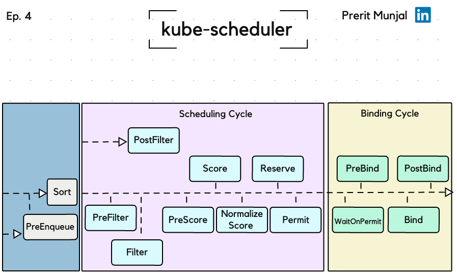

## Kubernetes Scheduler Tutorial

### Table of Contents
1. [Prerequisites](#prerequisites)
2. [Components Prior to the Scheduling Cycle](#components-prior-to-the-scheduling-cycle)
    - [PreEnqueue](#preenqueue)
    - [Sort](#sort)
3. [Scheduling Cycle](#scheduling-cycle)
    - [PreFilter](#prefilter)
    - [Filter](#filter)
    - [PostFilter](#postfilter)
    - [PreScore](#prescore)
    - [Score](#score)
    - [NormalizeScore](#normalizescore)
    - [Reserve](#reserve)
    - [Permit](#permit)
4. [Binding Cycle](#binding-cycle)
    - [PreBind](#prebind)
    - [Bind](#bind)
    - [PostBind](#postbind)
5. [Taints and Tolerations](#taints-and-tolerations)
6. [Preemption and Priorities](#preemption-and-priorities)
7. [Inter-Relatedness of Components](#inter-relatedness-of-components)
8. [Memorization vs Understanding](#memorization-vs-understanding)
9. [Conclusion](#conclusion)

### Prerequisites

Before diving into the scheduler, it's essential to have a basic understanding of Kubernetes architecture, including ETCD, API server, and controllers.

  

### Components Prior to the Scheduling Cycle

#### PreEnqueue
- Performs all the necessary checks and segregates pods into the ActiveQ, UnscheduableQ, or PodBackoffQ.
- Ensures only valid pods enter the scheduling queue.

#### Sort
- Once a pod specification is received, the scheduler sorts the pods in the scheduling queue based on their priorities and other criteria.
- This ensures higher priority pods are scheduled before lower priority ones.

### Scheduling Cycle

The scheduling cycle begins once the scheduler receives a scheduling request. The scheduler typically gets its scheduling requests from the ETCD via the API server.

#### PreFilter
- PreFilter checks certain criteria before the main filtering process.
- This includes validating that the pod can be scheduled based on simple, quick-to-check criteria like node availability, resource requests, and pod/node labels.
- It also deals with taints and tolerations to ensure that pods without appropriate tolerations are not scheduled on nodes with taints.

#### Filter
- The Filter stage removes nodes from the list of potential candidates based on specific constraints.
- Criteria such as taints and tolerations, node affinity/anti-affinity, and resource capacity are considered.
- Nodes with taints that are not tolerated by the pod are filtered out, meaning they are not considered for scheduling the pod.

#### PostFilter
- PostFilter handles scenarios where filtering fails to find suitable nodes.
- It may perform actions like preempting lower-priority pods to make room for higher-priority ones.

#### PreScore
- PreScore allows for preliminary calculations that might be needed before scoring nodes.
- This can include custom logic to prepare the nodes for scoring.

#### Score
- In the Score stage, each remaining node is assigned a score based on how well it meets the pod’s requirements.
- Factors include node capacity, resource usage, and any custom scoring functions defined in the scheduler.

#### NormalizeScore
- NormalizeScore adjusts the scores to fit a specific range or scale, ensuring they are comparable.
- This step ensures fairness in ranking nodes.

#### Reserve
- During the Reserve stage, resources on the chosen node are reserved for the pod.
- This prevents other pods from being scheduled on the same resources.

#### Permit
- Permit is a final check before binding, allowing for any last-minute verifications or permissions.
- This plugin consists of three phases: Approve, Deny, and Wait. Approve gives a green flag for binding, Deny returns the pod to the scheduling queue, and Wait holds the pod until approval.

### Binding Cycle

#### PreBind
- PreBind is a preparation step before the actual binding.
- It can include steps like setting up necessary resources or configurations on the node.

#### Bind
- Bind is the final step where the pod is officially bound to the node.
- The scheduler informs the API server of the decision, and the pod starts running on the node.

#### PostBind
- PostBind actions occur after the pod is bound to a node.
- This can involve cleanup tasks or notifying other components of the binding.
- This marks the end of the binding cycle and declares the result.

If any Binding Cycle plugin rejects the pod, it is again sent to the scheduling queue. Scheduling cycles are run serially, while Binding cycles may run concurrently.

### Taints and Tolerations

**Taints**:
- A taint is a property that can be added to a node to indicate that it should not accept any pods that do not explicitly tolerate the taint.
- Taints have three parts: key, value, and effect. The effect can be one of three values: `NoSchedule`, `PreferNoSchedule`, or `NoExecute`.

**Tolerations**:
- A toleration is a property added to a pod that allows it to be scheduled onto a node with matching taints.
- Tolerations allow pods to tolerate the taints applied to nodes, thereby being scheduled onto those nodes despite the taints.

**PreFilter and Filter Stages**:
- **PreFilter** checks if the pod has any tolerations that allow it to be scheduled on nodes with taints. This quick validation ensures that pods are eligible to be considered for nodes with taints.
- **Filter** performs a detailed evaluation of nodes based on their taints and the pod's tolerations. Nodes with taints that are not tolerated by the pod are filtered out, ensuring that pods are only scheduled on compatible nodes.

### Preemption and Priorities

**Pod Priority**:
- Each pod can be assigned a priority value, which is an integer. Higher values indicate higher priority.
- Priority values help the scheduler determine which pods should be scheduled first when resources are limited.

**Preemption**:
- Preemption is the process of evicting lower-priority pods to free up resources for higher-priority pods.
- When a high-priority pod cannot be scheduled due to resource constraints, the scheduler looks for lower-priority pods that can be preempted.

**Preemption Process**:
1. **Identify Nodes**: The scheduler identifies nodes where the higher-priority pod could be scheduled if certain lower-priority pods were evicted.
2. **Select Victims**: The scheduler selects which lower-priority pods (victims) to preempt based on their priority and the resources they consume.
3. **Eviction**: The identified lower-priority pods are evicted, freeing up resources.
4. **Retry Scheduling**: The scheduler retries scheduling the higher-priority pod with the newly available resources.

### Inter-Relatedness of Components

- **Sort and PreEnqueue**: Sort ensures that higher priority pods are scheduled first, while PreEnqueue ensures only valid pods enter the queue.
- **PreFilter, Filter, and PostFilter**: PreFilter quickly checks basic criteria, Filter removes unsuitable nodes, and PostFilter handles failures in finding nodes.
- **PreScore, Score, and NormalizeScore**: PreScore prepares nodes for scoring, Score assigns them values, and NormalizeScore ensures comparability.
- **Reserve and Permit**: Reserve allocates resources, and Permit confirms the final allowance before binding.
- **PreBind, PostBind, WaitOnPermit, and Bind**: PreBind prepares for binding, PostBind handles post-binding tasks, WaitOnPermit manages timing, and Bind completes the process.

### Memorization vs Understanding

It's essential not to memorize the sequence of stages by rote but to understand their purpose and how they interact. Understanding the functions and relationships between each component will better prepare you for practical applications and problem-solving.

### Conclusion

Understanding the Kubernetes scheduler involves knowing the flow from pod submission to binding. Each component in the scheduling and binding cycles plays a critical role in ensuring pods are efficiently and correctly scheduled on suitable nodes. By following this tutorial, you should have a comprehensive understanding of the kube-scheduler and its inner workings. Focus on understanding the concepts and their interrelationships rather than memorizing the steps, as this will provide a more robust foundation for both practical applications and system troubleshooting.
