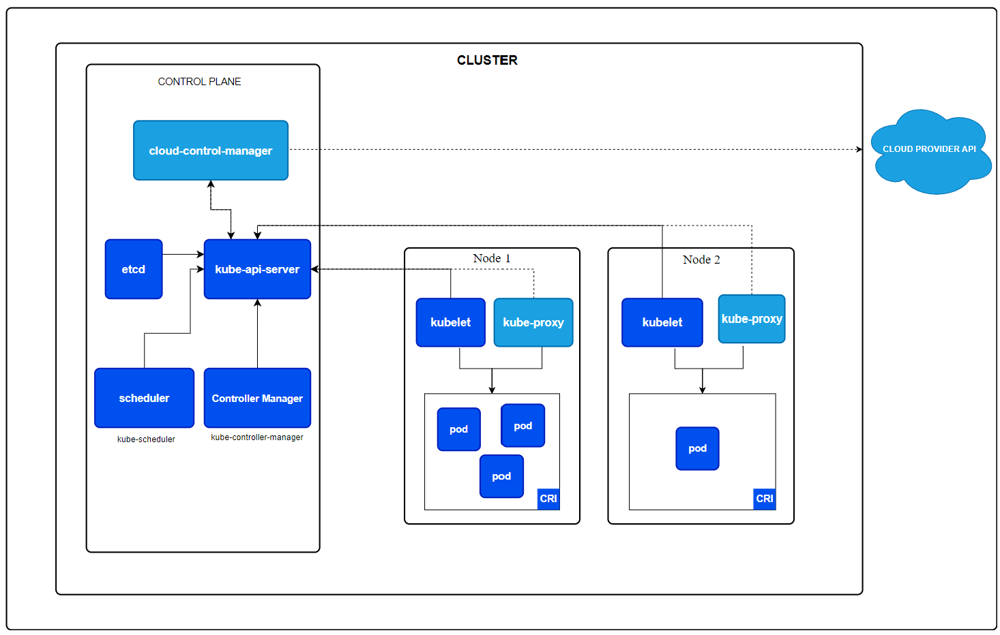

### Kubernetes Architecture

Kubernetes architecture is primarily divided into two main components: the Master Node (Control Plane) and the Worker Node (Slave Node).

#### Master Node (Control Plane)

The Master Node is responsible for managing and controlling the cluster. The Master Node consists of five main components, although in some cases, there might be four. These components are:

1. **ETCD**:
   - ETCD is a distributed file system used as a database.
   - It stores all the data for the Kubernetes cluster and manages it in a distributed manner.
   - "ETC" means a directory, and "D" means distributor, so ETCD is essentially a distributed file system.

2. **Kube API Server**:
   - This is the primary contact point for the Kubernetes cluster.
   - All administrative tasks and consoles communicate through this server.

3. **Scheduler**:
   - The Scheduler determines which nodes are suitable for hosting newly created or scaled-up pods based on resource availability.

4. **Controller Manager**:
   - The Controller Manager runs controller processes, which regulate the state of the cluster.
   - It ensures that the desired state of the cluster matches the actual state.

5. **Cloud Controller Manager** (optional):
   - This component interacts with the underlying cloud provider to manage cloud-specific resources.
   - It is a part of the Controller Manager but is used when running Kubernetes in a cloud environment.

#### Worker Node (Slave Node)

The Worker Nodes are responsible for running the containerized applications. Each Worker Node consists of the following components:

1. **Kubelet**:
   - The Kubelet is an agent that runs on each worker node.
   - It ensures that containers are running in a pod as expected.

2. **Kube Proxy**:
   - The Kube Proxy maintains network rules on the nodes.
   - It facilitates network communication to your pods from network sessions inside or outside of your cluster.

3. **Container Runtime**:
   - This is the software responsible for running containers.
   - Kubernetes supports several container runtimes, such as Docker, containerd, and CRI-O. 

These components work together to ensure the smooth operation and management of Kubernetes clusters, providing a robust platform for running and orchestrating containerized applications.

  

  

  

