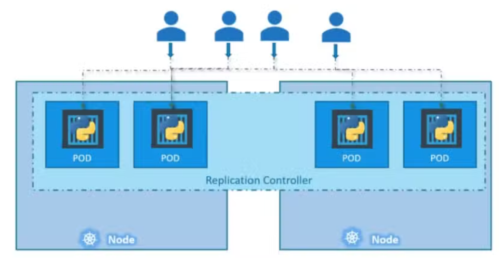

## ReplicaSet

---

### Table of Contents
1. [Introduction to ReplicaSets](#introduction)
2. [Homogeneous vs. Heterogeneous Pods](#homogeneous-vs-heterogeneous-pods)
3. [Creating and Scaling a ReplicaSet](#creating-and-scaling-a-replicaset)
4. [ReplicaSet YAML File Example](#replicaset-yaml-file-example)
5. [Understanding Selectors and Labels](#understanding-selectors-and-labels)
6. [Deleting Pods in a ReplicaSet](#deleting-pods-in-a-replicaset)
7. [Annotations in ReplicaSets](#annotations-in-replicasets)
8. [Checking if a Pod is Part of a ReplicaSet](#checking-if-a-pod-is-part-of-a-replicaset)
9. [How ReplicaSets Handle Scaling Down Pods](#scaling-down-pods)

---

### 1. Introduction to ReplicaSets <a name="introduction"></a>

A **ReplicaSet** is a Kubernetes resource that ensures a specified number of pod replicas are running at all times. It can handle both homogeneous (identical) and heterogeneous (different) pods, depending on the configuration. Unlike the older Replica Controllers, ReplicaSets offer more flexibility and are the recommended approach in modern Kubernetes deployments. ReplicaSets and ReplicaControllers can span across different nodes if there's a need to scale. 

**Interview Tip:** You might be asked to explain the difference between a ReplicaSet and a Deployment, or why ReplicaSets are preferred over Replica Controllers.

<div style="text-align: center;">
  
</div>

[Back to TOC](#table-of-contents)

---

### 2. Homogeneous vs. Heterogeneous Pods <a name="homogeneous-vs-heterogeneous-pods"></a>

ReplicaSets can manage both homogeneous and heterogeneous pods:

- **Homogeneous Pods:** All pods are identical, running the same application (e.g., all pods running Nginx).
- **Heterogeneous Pods:** Pods run different applications (e.g., one pod running Redis, another running Nginx, another MongoDB).

**Example Output:**
```yaml
apiVersion: apps/v1
kind: ReplicaSet
metadata:
  name: example-homogeneous-rs
spec:
  replicas: 3
  selector:
    matchLabels:
      app: nginx
  template:
    metadata:
      labels:
        app: nginx
    spec:
      containers:
      - name: nginx
        image: nginx:latest
```

For heterogeneous pods, you can modify the template to include different containers:

```yaml
apiVersion: apps/v1
kind: ReplicaSet
metadata:
  name: example-heterogeneous-rs
spec:
  replicas: 3
  selector:
    matchLabels:
      app: mixed
  template:
    metadata:
      labels:
        app: mixed
    spec:
      containers:
      - name: nginx
        image: nginx:latest
      - name: redis
        image: redis:latest
```

[Back to TOC](#table-of-contents)

---

### 3. Creating and Scaling a ReplicaSet <a name="creating-and-scaling-a-replicaset"></a>

To create a ReplicaSet, you define the desired number of pod replicas in a YAML file and apply it using `kubectl`.

**Example YAML for ReplicaSet:**
```yaml
apiVersion: apps/v1
kind: ReplicaSet
metadata:
  name: rs-demo
spec:
  replicas: 3
  selector:
    matchLabels:
      app: demo
  template:
    metadata:
      labels:
        app: demo
    spec:
      containers:
      - name: nginx
        image: nginx:latest
```

**Creating the ReplicaSet:**
```bash
kubectl apply -f rs-demo.yaml
```

**Scaling the ReplicaSet:**
```bash
kubectl scale rs rs-demo --replicas=5
```

**Output:**
```bash
replicaset.apps/rs-demo scaled
```

[Back to TOC](#table-of-contents)

---

### 4. ReplicaSet YAML File Example <a name="replicaset-yaml-file-example"></a>

The following YAML file shows all the keys and values discussed in the transcript:

```yaml
apiVersion: apps/v1
kind: ReplicaSet
metadata:
  name: rs-demo
  labels:
    type: rs
    env: dev
spec:
  replicas: 3
  selector:
    matchLabels:
      release: "alpha v2.1"
  template:
    metadata:
      labels:
        release: "alpha v2.1"
    spec:
      containers:
      - name: nginx
        image: nginx:latest
```

**Key Points:**
- `apiVersion: apps/v1`: Indicates the API version.
- `kind: ReplicaSet`: Specifies the resource type.
- `metadata`: Includes the name and labels.
- `spec`: Defines the desired state, including replicas, selector, and pod template.

[Back to TOC](#table-of-contents)

---

### 5. Understanding Selectors and Labels <a name="understanding-selectors-and-labels"></a>

Selectors and labels are crucial in ReplicaSets. The selector determines which pods belong to the ReplicaSet based on their labels. The labels in the pod template must match the selector labels.

**Interview Tip:** You may be asked how selectors and labels function in maintaining the desired state of a ReplicaSet.

**Example YAML:**
```yaml
apiVersion: apps/v1
kind: ReplicaSet
metadata:
  name: rs-example
spec:
  replicas: 3
  selector:
    matchLabels:
      app: example
  template:
    metadata:
      labels:
        app: example
    spec:
      containers:
      - name: nginx
        image: nginx:latest
```

**Output:**
```bash
kubectl apply -f rs-example.yaml
replicaset.apps/rs-example created
```

[Back to TOC](#table-of-contents)

---

### 6. Deleting Pods in a ReplicaSet <a name="deleting-pods-in-a-replicaset"></a>

When a pod managed by a ReplicaSet is deleted, the ReplicaSet automatically creates a new one to maintain the desired replica count.

**Command to Delete a Pod:**
```bash
kubectl delete pod <pod-name>
```

**Output:**
```bash
pod "<pod-name>" deleted
```

Immediately after deletion, a new pod is created to replace the deleted one.

[Back to TOC](#table-of-contents)

---

### 7. Annotations in ReplicaSets <a name="annotations-in-replicasets"></a>

Annotations provide additional metadata to pods, which can be used for various purposes, such as maintaining information about the maintainer or other important details.

**Adding an Annotation:**
```bash
kubectl annotate pod <pod-name> maintainer="your-email@example.com"
```

**Checking Annotations:**
```bash
kubectl describe pod <pod-name> | grep Annotations
```

**Output:**
```bash
Annotations: maintainer=your-email@example.com
```

[Back to TOC](#table-of-contents)

---

### 8. Checking if a Pod is Part of a ReplicaSet <a name="checking-if-a-pod-is-part-of-a-replicaset"></a>


To verify if a pod is part of a ReplicaSet, you should check the `ownerReferences` field in the pod’s specification. This field indicates that the pod is owned and managed by a higher-level Kubernetes controller, such as a ReplicaSet, Deployment, or StatefulSet.

#### What Happens if `ownerReferences` Field Isn't Present?

- **Pod Not Managed:** If the `ownerReferences` field is missing, the pod is not managed by any controller. This means if the pod fails or is deleted, there is no automated mechanism to recreate it.
- **Pod Can Be Acquired:** A pod without an `ownerReferences` field can be acquired by a controller (e.g., a ReplicaSet) if its labels match the selector defined in the controller's configuration. Once acquired, the controller adds the `ownerReferences` field to the pod’s spec, indicating ownership.

#### Example of `ownerReferences` in Pod Specification:

Here’s an example of what the `ownerReferences` field looks like when a pod is part of a ReplicaSet:

```yaml
ownerReferences:
- apiVersion: apps/v1
  kind: ReplicaSet
  name: rs-demo
  uid: 12345-abcde-67890
  controller: true
```

- **apiVersion:** The version of the API the owner belongs to.
- **kind:** The type of resource managing the pod (in this case, a ReplicaSet).
- **name:** The name of the ReplicaSet managing the pod.
- **uid:** A unique identifier for the ReplicaSet.
- **controller:** Indicates whether the owner is a controller (`true` means it is).

#### Checking for `ownerReferences` in a Pod:

You can use the following command to check if a pod has been acquired by a ReplicaSet:

```bash
kubectl describe pod <pod-name>
```

Look for the `ownerReferences` field in the output. If it’s present and shows `kind: ReplicaSet` with `controller: true`, the pod is managed by a ReplicaSet.

**Example Command:**
```bash
kubectl describe pod my-pod | grep -A 5 "ownerReferences"
```

**Expected Output:**
```yaml
ownerReferences:
- apiVersion: apps/v1
  kind: ReplicaSet
  name: rs-demo
  uid: 12345-abcde-67890
  controller: true
```

**Key Point:** If no `ownerReferences` field is found, the pod is not currently managed by any controller and can be acquired by a ReplicaSet or other controllers.

**Interview Tip:** Be prepared to discuss how `ownerReferences` ensures that Kubernetes controllers like ReplicaSets manage the lifecycle of pods, including how they automatically replace failed pods to maintain the desired state.

[Back to TOC](#table-of-contents)


---

### 9. How ReplicaSets Handle Scaling Down Pods <a name="scaling-down-pods"></a>

When a ReplicaSet needs to scale down (i.e., reduce the number of running pods), it must decide which pods to delete while maintaining the overall health and balance of the application. The ReplicaSet controller follows a specific algorithm to prioritize the order in which pods are scaled down.

Here’s a step-by-step breakdown of the process:

#### 1. Pending (and Unschedulable) Pods are Scaled Down First
- **Pending Pods:** Pods that are in a pending state and cannot be scheduled on any node are the first to be terminated. These pods are prioritized because they are not actively contributing to the application's workload and are likely consuming unnecessary resources.

#### 2. Pods with Lower Pod Deletion Cost are Prioritized Next
- **Pod Deletion Cost:** If the `controller.kubernetes.io/pod-deletion-cost` annotation is set on the pods, the controller uses this value to determine which pods to delete. The pods with lower deletion costs are deleted first. This annotation allows for fine-grained control over which pods should be kept running when scaling down, useful in scenarios where some pods are more critical than others.

**Example:**
```yaml
annotations:
  controller.kubernetes.io/pod-deletion-cost: "-10"
```
- Pods with a lower (more negative) deletion cost will be deleted before those with higher (less negative or positive) costs.

#### 3. Pods on Nodes with More Replicas are Prioritized
- **Node Balance:** The controller prefers to delete pods on nodes that have a higher number of replicas compared to others. This helps to evenly distribute the workload across the cluster and avoid situations where some nodes might be overloaded while others are underutilized.

#### 4. More Recently Created Pods are Deleted First
- **Creation Time:** If the pods' creation times differ, the more recently created pods are prioritized for deletion over older pods. This ensures that the longest-running and likely more stable pods remain active. When the `LogarithmicScaleDown` feature gate is enabled, the creation times are bucketed on an integer log scale to make the selection more robust.

**Logarithmic Scale Down (Optional Feature):**
- **Bucketed Deletion:** When enabled, this feature uses a logarithmic scale to group pods by their creation time. This means that instead of simply comparing creation timestamps, pods are grouped into "buckets" of similar age, and pods from newer buckets are prioritized for deletion.

### Example of Pod Deletion Prioritization:
Consider a scenario where a ReplicaSet is scaling down from 5 pods to 3. The controller might follow these steps:

1. **Pending Pod:** If there is 1 pending pod, it will be deleted first.
2. **Pod Deletion Cost:** Among the remaining pods, if one has a `pod-deletion-cost` of `-5` and another has `-10`, the one with `-10` will be deleted first.
3. **Node Balance:** If the remaining pods are running on two different nodes, the controller will prefer deleting a pod from the node with more pods.
4. **Creation Time:** If all other factors are equal, the most recently created pod will be deleted.

---

### Key Takeaways:
- **Efficiency:** The scaling-down algorithm ensures that the most resource-efficient and least impactful pods are deleted first.
- **Customization:** Annotations like `pod-deletion-cost` allow for greater control over which pods should be terminated first.
- **Balance:** The algorithm maintains balance across nodes and ensures that the oldest and most stable pods continue to run.

**Interview Tip:** Be prepared to explain the logic behind these prioritization rules and how they help maintain the health and balance of the Kubernetes cluster during scaling operations.

[Back to TOC](#table-of-contents)


