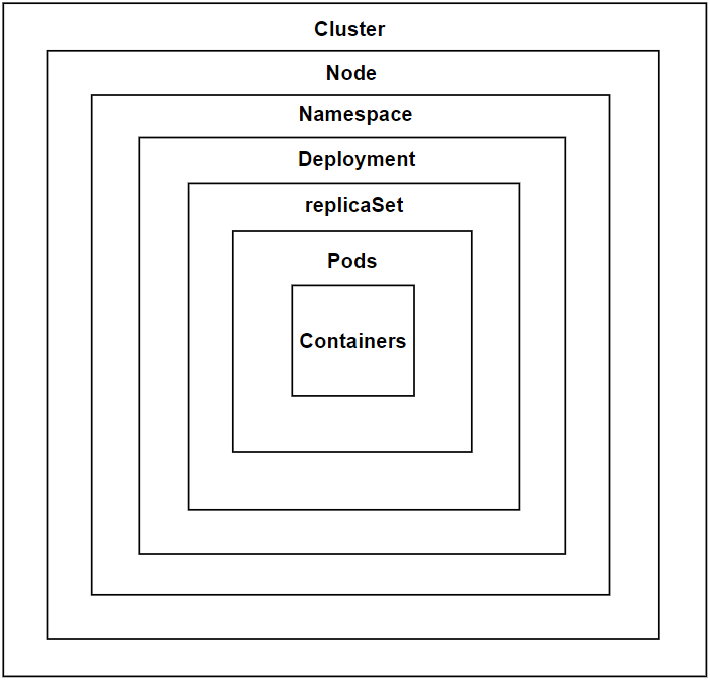

## Revisting Kubernetes Architecture

### Table of Contents

1. [Introduction to Kubernetes Architecture](#introduction-to-kubernetes-architecture)
2. [Clusters](#clusters)
3. [Nodes](#nodes)
4. [Namespaces](#namespaces)
5. [Deployments](#deployments)
6. [ReplicaSets](#replicasets)
7. [Pods](#pods)
8. [Containers](#containers)

---

### Introduction to Kubernetes Architecture

Kubernetes is built on a layered architecture that helps manage containerized applications at scale. Each layer serves a distinct purpose, contributing to the flexibility, scalability, and security of your application infrastructure.

  

[Kubernetes Architecture](https://kubernetes.io/docs/concepts/overview/components/)

[Back to TOC](#table-of-contents)

---

### Clusters

A **cluster** in Kubernetes is a collection of nodes (machines) that run containerized applications. A cluster is the highest level of abstraction and encompasses all resources that are managed by Kubernetes.

- **Interview Question**: If you delete a cluster, will all resources be deleted? The answer is no; everything except persistent volumes will be deleted. Persistent volumes are not deleted because Kubernetes' primary goal is to prevent data loss.

[Back to TOC](#table-of-contents)

---

### Nodes

**Nodes** are the worker machines in Kubernetes. A cluster may have multiple nodes, and each node could have different hardware characteristics, such as being optimized for CPU, GPU, or memory.

- **Interview Question**: Within a cluster, we have nodes that can be of any type—GPU nodes, TPU nodes, or CPU nodes. 

[Back to TOC](#table-of-contents)

---

### Namespaces

**Namespaces** are logical boundaries within a Kubernetes cluster. They allow you to organize and manage resources effectively without needing to create separate clusters. Namespaces are particularly useful when you want to run multiple applications within the same cluster but maintain some level of isolation between them.

- **Interview Question**: Are Kubernetes namespaces similar to kernel namespaces? The answer is that the working principle is similar, but the level of abstraction is different.

[Back to TOC](#table-of-contents)

---

### Deployments

**Deployments** in Kubernetes provide a higher level of abstraction for managing pods and ReplicaSets. Deployments simplify the process of scaling and updating applications, making it easier to manage containerized applications in production environments.

- **Key Information**: Before Deployments were introduced, managing applications was cumbersome. Today, 99.9% of applications run under Deployments.

[Back to TOC](#table-of-contents)

---

### ReplicaSets

A **ReplicaSet** is responsible for maintaining a stable set of replica pods running at any given time. When you create a Deployment, a ReplicaSet is automatically created under the hood to ensure the desired number of pod replicas are running.

[Back to TOC](#table-of-contents)

---

### Pods

**Pods** are the smallest and simplest Kubernetes objects. They represent a single instance of a running process in your cluster. A pod can contain one or more containers, which share the same network namespace and storage.

- **Interview Question**: What happens if you don’t add labels? By default, Kubernetes will add a label with the key "run" and the value as the pod's name.

[Back to TOC](#table-of-contents)

---

### Containers

**Containers** are the runtime units of your application within a pod. They encapsulate the application code and its dependencies. Containers in Kubernetes are managed by cgroups or similar mechanisms to ensure resource isolation and allocation.

- **Key Information**: In the spec section of a Kubernetes configuration file, you specify the container's image, which can be pulled from private or public repositories.

[Back to TOC](#table-of-contents)
