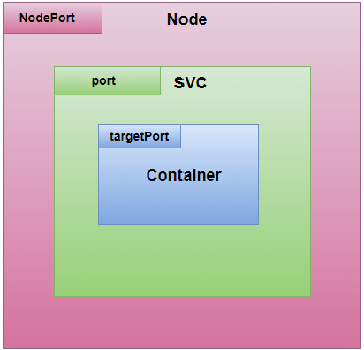
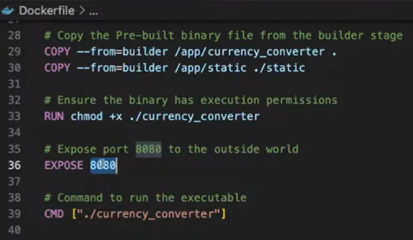

### Tutorial: Understanding Ports in Kubernetes Services

---

#### Table of Contents
- [Introduction to Ports in Kubernetes](#introduction-to-ports-in-kubernetes)
- [Node Port, Target Port, and Service Port Explained](#node-port-service-port-and-target-port-explained)
  - [Node Port](#node-port)
  - [Service Port](#service-port)
  - [Target Port](#target-port)
- [Common Issues and Best Practices](#issues-best-practices)
  - [Misconfigured Ports](#misconfigured-ports)
  - [Default Behavior of Ports](#default-behavior)
- [Selectors in Services](#selectors)
  - [Services Without Selectors](#without-selectors)
  - [Creating Endpoint Slices](#endpoint-slices)
- [ClusterIP and NodePort Services](#clusterip-nodeport)
  - [Understanding ClusterIP](#clusterip)
  - [NodePort vs. Service IPs](#nodeport-vs-service-ips)
- [Ingress and Load Balancers](#ingress-load-balancers)
  - [Exposing Services with Ingress](#exposing-services-ingress)
  - [Creating a Load Balancer](#creating-load-balancer)
- [Conclusion](#conclusion)

---

### Introduction to Ports in Kubernetes
In Kubernetes, understanding how ports function is crucial for ensuring that your application communicates effectively within a cluster. This tutorial will guide you through the essential concepts of Node Port, Target Port, and Service Port, and provide insights into common issues and best practices.

[Back to TOC](#table-of-contents)

---

### Node Port, Service Port, and Target Port Explained

<div style="text-align: center;">
  
</div>

#### Node Port
The Node Port is the port on the node where your application is exposed. It’s a straightforward concept that indicates where the application is accessible on the node itself.

Example:
```yaml
apiVersion: v1
kind: Service
metadata:
  name: my-service
spec:
  type: NodePort
  selector:
    app: MyApp
  ports:
    - port: 80
      targetPort: 8080
      nodePort: 30007
```

In this example, the Node Port is `30007`, meaning the service can be accessed via this port on any node in the cluster.

[Back to TOC](#table-of-contents)


#### Service Port
The Service Port is the port on which the Kubernetes service is exposed within the cluster. This port allows communication between services or pods within the Kubernetes environment.

Example:
```yaml
ports:
  - port: 80
    targetPort: 8080
```
Here, the service listens on port `80` and forwards traffic to the target port `8080`.

[Back to TOC](#table-of-contents)


#### Target Port
The Target Port is where the container inside the pod listens for traffic. It is crucial to ensure that the target port specified in the service matches the port exposed by the container.

Example:
```yaml
ports:
  - port: 80
    targetPort: 8080
```
In this example, the container listens on port `8080`, but the service exposes port `80`.

[Back to TOC](#table-of-contents)


---

### Common Issues and Best Practices

#### Misconfigured Ports
One of the most common issues is misconfiguring ports, where the exposed port in the Docker file doesn’t match the service’s target port. This misconfiguration leads to communication failures within the application.

**Best Practice**: Always ensure that the port exposed by your container (in the Dockerfile) matches the target port in your Kubernetes service configuration.

<div style="text-align: center;">
  
</div>


[Back to TOC](#table-of-contents)

#### Default Behavior of Ports
By default, Kubernetes sets the target port equal to the service port if no specific target port is provided. This behavior is essential to understand to avoid unintended misconfigurations.

Example:
```yaml
ports:
  - port: 80
    targetPort: 80
```
If no target port is specified, the service assumes the container listens on the same port it exposes.

[Back to TOC](#table-of-contents)

---

### Selectors in Services

#### Services Without Selectors
It is possible to create a service without selectors. However, in such cases, you must manually create endpoint slices to define where the service should direct traffic.

Example:
```yaml
apiVersion: v1
kind: Service
metadata:
  name: my-service
spec:
  ports:
    - port: 80
```
In this configuration, the service is created without a selector, and you need to manually define the endpoints.

[Back to TOC](#table-of-contents)

#### Creating Endpoint Slices
Endpoint slices need to be manually created if your service lacks selectors. This method allows for more flexible routing of traffic.

Example:
```yaml
apiVersion: discovery.k8s.io/v1
kind: EndpointSlice
metadata:
  name: my-service-endpoints
  labels:
    kubernetes.io/service-name: my-service
endpoints:
  - addresses:
      - "10.0.0.1"
      - "10.0.0.2"
ports:
  - port: 80
```
This endpoint slice directs traffic to the specified IPs and ports, even without a service selector.

[Back to TOC](#table-of-contents)

---

### ClusterIP and NodePort Services

#### Understanding ClusterIP
ClusterIP is the default service type in Kubernetes. It exposes the service on an internal IP within the cluster, making it accessible only within the cluster.

Example:
```yaml
apiVersion: v1
kind: Service
metadata:
  name: my-clusterip-service
spec:
  type: ClusterIP
  selector:
    app: MyApp
  ports:
    - port: 80
      targetPort: 8080
```
Here, the service is exposed internally on port `80`, forwarding traffic to port `8080` in the container.

[Back to TOC](#table-of-contents)

#### NodePort vs. Service IPs
NodePort services expose the service on a static port on each node's IP, while ClusterIP services use an internal IP within the cluster. These two have different use cases and should be chosen based on the requirement.

**Interview Tip**: Understanding the difference between NodePort and ClusterIP is crucial for answering questions about service exposure in Kubernetes.

[Back to TOC](#table-of-contents)

---

### Ingress and Load Balancers

#### Exposing Services with Ingress
Ingress is used to expose HTTP and HTTPS routes from outside the cluster to services within the cluster. It acts as a smart router that routes traffic based on rules defined in the ingress resource.

Example:
```yaml
apiVersion: networking.k8s.io/v1
kind: Ingress
metadata:
  name: my-ingress
spec:
  rules:
  - host: myapp.example.com
    http:
      paths:
      - path: /
        pathType: Prefix
        backend:
          service:
            name: my-service
            port:
              number: 80
```
This ingress rule routes traffic from `myapp.example.com` to the service named `my-service` on port `80`.

[Back to TOC](#table-of-contents)

#### Creating a Load Balancer
Load balancers distribute incoming network traffic across multiple servers, ensuring no single server bears too much load. Kubernetes supports load balancers natively, which can be created easily.

Example:
```yaml
apiVersion: v1
kind: Service
metadata:
  name: my-loadbalancer-service
spec:
  type: LoadBalancer
  selector:
    app: MyApp
  ports:
    - port: 80
      targetPort: 8080
```
Here, the service is exposed externally through a load balancer, distributing traffic to the pods that match the selector.

[Back to TOC](#table-of-contents)

---

### Conclusion
Understanding the different ports in Kubernetes—Node Port, Target Port, and Service Port—along with the concepts of ClusterIP, NodePort, Ingress, and Load Balancers, is essential for effective Kubernetes service management. Correctly configuring these elements ensures that your applications run smoothly and communicate efficiently within the cluster.

[Back to TOC](#table-of-contents)
