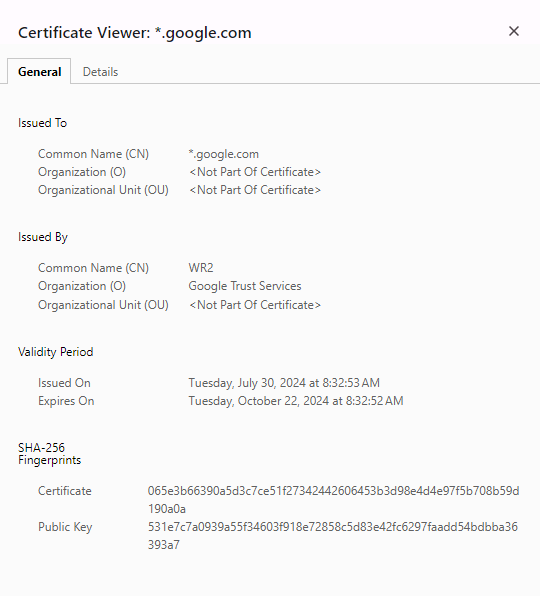

### Understanding and Viewing Certificates in Kubernetes

Certificates are a crucial component in ensuring the security and integrity of communications within a Kubernetes cluster. They are used to establish secure connections (SSL/TLS) and to verify the identity of components within the cluster. Here's how you can view and manage certificates in Kubernetes, along with the important details that can be obtained from them.

#### Viewing Certificate Details in a Browser

When you're accessing a secure site over HTTPS, the browser will display a padlock icon indicating that the connection is secure. Here's how you can view the certificate details:

1. **Access the Website:**
   - Go to the website using a browser like Chrome, Firefox, or Edge.

2. **View the Certificate:**
   - Click on the padlock icon in the address bar.
   - A dropdown will appear; select the option that says "Certificate" or "View Certificate."

3. **Certificate Information:**
   - You will see details such as:
     - **Issued On:** The date when the certificate was issued.
     - **Expires On:** The expiration date of the certificate.
     - **Issuer:** The authority that issued the certificate.
     - **Subject:** The entity to whom the certificate was issued.

   Example Screenshot:
   <div style="text-align: center;">
  
</div>
   *This image shows a sample certificate with fields like 'Issued On' and 'Expires On.'*

#### Understanding Certificate Expiry

Certificates have an expiration date to ensure that they remain secure and up-to-date. It's important to regularly check the expiration date of certificates in your cluster to avoid potential downtime.

- **Expiration Date:** Typically, certificates are issued for a period such as one year. Once expired, the certificate must be renewed, or the secure communication will fail.

- **Viewing Expiration in a Kubernetes Cluster:**
   - You can use the following command to view certificate details in a Kubernetes cluster:
     ```bash
     kubectl get secrets -n <namespace> | grep tls
     ```
   - To view more detailed information, including the expiration date, you can describe the secret:
     ```bash
     kubectl describe secret <secret-name> -n <namespace>
     ```
   - This command will display detailed information, including the certificate’s expiration date.

#### Importance of Regular Certificate Management

Regularly managing and renewing certificates is critical. A cluster might go down if certificates expire and are not renewed in time. Tools like Cert-Manager can automate the renewal process to avoid manual intervention.

#### Additional Tips:

- **Set Alerts:** Consider setting up alerts for certificate expiration using monitoring tools like Prometheus or Grafana.
- **Automate Renewal:** Tools like Cert-Manager in Kubernetes can automate the renewal of certificates.

By following these practices, you ensure that your cluster remains secure and operational, preventing any potential issues related to expired certificates.
