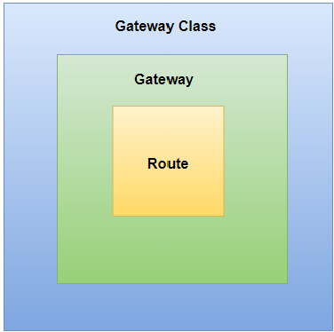

# Gateway API in Kubernetes: A Comprehensive Guide

This tutorial delves into the Gateway API in Kubernetes, explaining its purpose, structure, and how to set it up. We’ll explore various layers involved in the Gateway API, providing examples with YAML manifests and output commands to illustrate the concepts clearly.

## Table of Contents
1. [Introduction to Gateway API](#introduction-to-gateway-api)
2. [Understanding the Layers in Gateway API](#understanding-the-layers-in-gateway-api)
3. [Modularity and Box Within a Box Concept](#modularity-and-box-within-a-box-concept)
   - [Team-Based Management](#team-based-management)
4. [Gateway API Components](#gateway-api-components)
5. [Creating and Configuring GatewayClasses](#creating-and-configuring-gatewayclasses)
6. [Setting Up Gateways and Routes](#setting-up-gateways-and-routes)
7. [Managing and Troubleshooting Gateways](#managing-and-troubleshooting-gateways)
   - [Creating a Gateway](#creating-a-gateway)
   - [Listing All Gateways](#listing-all-gateways)
   - [Describing a Gateway](#describing-a-gateway)
   - [Deleting a Gateway](#deleting-a-gateway)
   - [Troubleshooting Tips](#troubleshooting-tips)
8. [Conclusion](#conclusion)

---

### Introduction to Gateway API

The Gateway API is a set of resources that model service networking in Kubernetes. It provides a more expressive and extensible way to define how traffic enters and leaves the Kubernetes cluster. Unlike traditional Ingress resources, the Gateway API introduces a layered approach that separates infrastructure concerns from application-level routing.

[Back to TOC](#table-of-contents)

### Understanding the Layers in Gateway API

The Gateway API introduces a layered model, each with specific responsibilities:

1. **Infrastructure Layer**: This layer involves `GatewayClass` and `Gateway` resources, defining the infrastructure that handles ingress traffic. The infrastructure layer is where you set up the core configuration for how traffic is managed before reaching the application layer.

2. **Application Layer**: This layer includes resources like `HTTPRoute`, `TCPRoute`, `TLSRoute`, and others. It focuses on application-specific routing rules, allowing for granular control over traffic routing, such as matching paths, headers, and directing traffic to specific services.

3. **Policy Layer**: Policies are applied across both infrastructure and application layers to enforce rules like security policies, traffic shaping, and more.

Each layer is independent yet interacts with the others to create a comprehensive networking configuration.

[Back to TOC](#table-of-contents)

### Modularity and Box Within a Box Concept

The Gateway API in Kubernetes can be understood through the concept of "box within a box." This analogy helps to illustrate how the different components like `GatewayClass`, `Gateway`, and `HTTPRoute` are designed to be modular and can be managed independently.

<div style="text-align: center;">
  
</div>


1. **GatewayClass as the Outer Box**: The `GatewayClass` represents the top-level configuration, defining how Gateways are instantiated and managed. It serves as the blueprint for creating Gateways, specifying parameters and behaviors that apply to all Gateways using this class. The `GatewayClass` can be thought of as the "outer box," setting the overarching rules and infrastructure setup.

2. **Gateway as the Inner Box**: Within the `GatewayClass`, you have individual `Gateways`. Each `Gateway` is a concrete instance that represents an entry point for network traffic. It inherits the configuration from the `GatewayClass` but can have its own specific settings, such as listeners and routing policies. The `Gateway` is like an "inner box" within the `GatewayClass`, tailored to handle specific traffic management needs.

3. **HTTPRoute as the Innermost Box**: Finally, within a `Gateway`, you have `HTTPRoute` (or other types of routes like `TCPRoute`). These routes define how traffic that enters the Gateway is directed to different services within the cluster. The `HTTPRoute` is the "innermost box," specifying granular routing rules based on paths, headers, or other criteria.

#### Team-Based Management

Because of this modular structure, different teams can manage each component independently:

- **Infrastructure Provider Team**: Might be responsible for managing `GatewayClass`, ensuring that the infrastructure layer is consistent and aligned with the organization’s networking policies.

- **Platform or Cluster Opertation Team**: Could manage the `Gateways`, ensuring they are correctly configured to route traffic appropriately, while also monitoring and scaling them as needed.

- **Application Development Team**: May manage `HTTPRoute` configurations, focusing on how traffic is routed to specific applications or services. This allows for granular control over traffic management without needing to understand the underlying infrastructure details.

This modular design makes the Gateway API highly flexible, allowing teams to work on their specific components without stepping on each other’s toes, ensuring better collaboration and clearer responsibilities.

[Back to TOC](#table-of-contents)

### Gateway API Components

The core components of the Gateway API include:

- **GatewayClass**: Defines the infrastructure for how gateways are instantiated.
- **Gateway**: Represents the entry point for network traffic, linking the infrastructure and application layers.
- **Routes (HTTPRoute, TCPRoute, etc.)**: Define the rules for routing traffic to Kubernetes services.

[Back to TOC](#table-of-contents)

### Creating and Configuring GatewayClasses

Let’s begin by creating a `GatewayClass`. The `GatewayClass` is the foundation of the infrastructure layer, defining the behavior of Gateways created under it.

```yaml
apiVersion: gateway.networking.k8s.io/v1alpha2
kind: GatewayClass
metadata:
  name: my-gateway-class
spec:
  controllerName: example.com/gateway-controller
  description: "This GatewayClass defines the base infrastructure for my Gateway."
```

This `GatewayClass` specifies that any `Gateway` created using this class will be managed by the `example.com/gateway-controller`.

[Back to TOC](#table-of-contents)

### Setting Up Gateways and Routes

Once the `GatewayClass` is defined, we can create a `Gateway`. The `Gateway` sits at the infrastructure layer and acts as the entry point for incoming traffic.

```yaml
apiVersion: gateway.networking.k8s.io/v1alpha2
kind: Gateway
metadata:
  name: my-gateway
spec:
  gatewayClassName: my-gateway-class
  listeners:
  - protocol: HTTP
    port: 80
    routes:
      kind: HTTPRoute
      selector:
        matchLabels:
          app: my-app
```

In this configuration, the `Gateway` listens on port 80 for HTTP traffic and forwards it to routes with the label `app: my-app`.

#### Adding Routes

Routes are defined at the application layer. Here’s an example of an `HTTPRoute` that directs traffic based on specific rules.

```yaml
apiVersion: gateway.networking.k8s.io/v1alpha2
kind: HTTPRoute
metadata:
  name: my-http-route
spec:
  parentRefs:
  - name: my-gateway
  hostnames:
  - "example.com"
  rules:
  - matches:
    - path:
        type: Prefix
        value: "/"
    forwardTo:
    - serviceName: my-service
      port: 80
```

This `HTTPRoute` configuration directs traffic from `example.com` to the `my-service` service on port 80, ensuring that requests to the root path (`/`) are handled correctly.

[Back to TOC](#table-of-contents)

### Managing and Troubleshooting Gateways

Managing Gateways involves common Kubernetes operations like creating, listing, describing, and deleting Gateways. Below are the steps along with the expected outputs:

#### Creating a Gateway

To create a Gateway, use the following command:

```sh
kubectl apply -f gateway.yaml
```

**Output:**

```sh
gateway.networking.k8s.io/my-gateway created
```

This output confirms that the Gateway has been successfully created.

[Back to TOC](#table-of-contents)

#### Listing All Gateways

To see all the Gateways in your cluster:

```sh
kubectl get gateways
```

**Output:**

```sh
NAME          CLASS               ADDRESS   READY   AGE
my-gateway    my-gateway-class    10.0.0.1  True    5m
```

This output lists the Gateway with its class, assigned address, readiness state, and age.

[Back to TOC](#table-of-contents)

#### Describing a Gateway

For detailed information about a specific Gateway:

```sh
kubectl describe gateway my-gateway
```

**Output:**

```sh
Name:         my-gateway
Namespace:    default
Address:      10.0.0.1
Listeners:
  - Port: 80
    Protocol: HTTP
Routes:
  - Kind: HTTPRoute
    Selector: app=my-app
```

This command provides a detailed description of the Gateway, including its listeners and associated routes.

[Back to TOC](#table-of-contents)

#### Deleting a Gateway

To remove a Gateway:

```sh
kubectl delete gateway my-gateway
```

**Output:**

```sh
gateway.networking.k8s.io "my-gateway" deleted
```

This output confirms that the Gateway has been successfully deleted.

[Back to TOC](#table-of-contents)

#### Troubleshooting Tips

When managing Gateways, you may encounter issues. Here are some common troubleshooting tips:

- **Check Gateway Status:** Ensure the Gateway

 is in a `Ready` state. If not, inspect the `GatewayClass` and `Listeners`.
- **Verify Routes:** Ensure your `HTTPRoute` or other route types are correctly linked to the Gateway and have valid configurations.
- **Logs:** Check the logs of your Gateway controller for any errors or warnings.

[Back to TOC](#table-of-contents)

### Conclusion

The Gateway API provides a powerful, layered approach to managing ingress traffic in Kubernetes. By separating infrastructure concerns from application-level routing, it allows for more flexible and scalable networking configurations. This tutorial walked you through setting up and managing Gateways, Routes, and understanding the layered structure that makes the Gateway API so versatile.

[Back to TOC](#table-of-contents)


### References

[Gateway API Documentation]([#table-of-contents](https://gateway-api.sigs.k8s.io/concepts/api-overview/))
