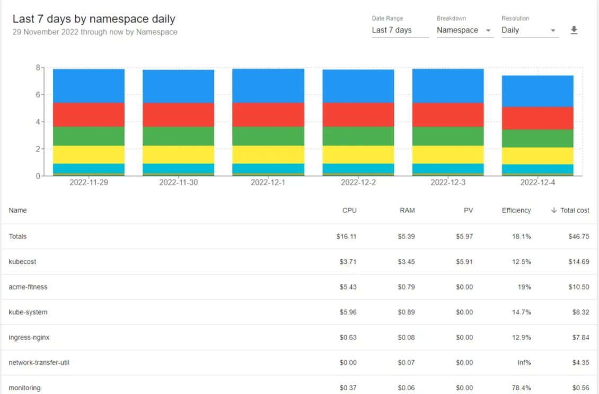

### Tutorial on Cost Optimization with OpenCost Using Kubernetes

### Table of Contents
1. [Introduction](#introduction)
2. [Overview of OpenCost](#overview-of-opencost)
3. [Installation and Setup](#installation-and-setup)
4. [Importance of Namespaces in Cost Optimization](#importance-of-namespaces-in-cost-optimization)
5. [Managing Node Pools for Cost Efficiency](#managing-node-pools-for-cost-efficiency)
6. [Taints and Tolerations](#taints-and-tolerations)
7. [Deleting OpenCost](#deleting-opencost)
8. [Conclusion](#conclusion)

---

### 1. Introduction
In this tutorial, we'll explore how to optimize costs in Kubernetes environments using the OpenCost tool. OpenCost is an open-source cost monitoring tool designed to help organizations monitor and manage the cost of running their applications in Kubernetes. We'll cover key features of OpenCost, including detailed cost breakdowns, real-time monitoring, and support for multiple cloud providers, as well as practical strategies like resource quotas, limit ranges, and node pools for managing resources effectively.

[Back to TOC](#table-of-contents)

---

### 2. Overview of OpenCost
OpenCost is a powerful tool that provides real-time visibility into the cost of running applications in Kubernetes. It supports a range of cloud providers, including AWS, Azure, and GCP, as well as on-premises Kubernetes clusters. This makes it an essential tool for organizations with complex or large-scale Kubernetes environments.

#### Key Features of OpenCost:
1. **Detailed Cost Breakdowns:** OpenCost provides detailed cost breakdowns for individual applications and components, helping users identify areas where costs are higher than expected.
2. **Real-time Cost Monitoring:** OpenCost offers real-time visibility into costs, which is invaluable for organizations managing expenses across different applications, teams, and departments.
3. **Multi-Cloud and On-Premises Support:** OpenCost supports AWS, Azure, GCP, and on-premises Kubernetes clusters, offering a comprehensive view of an organization's cloud spending.
4. **Custom Dashboards and Alerts:** Users can create custom dashboards and receive alerts when costs exceed specified thresholds.
5. **Export to Prometheus:** Pricing data can be easily exported to Prometheus using the `/metrics` endpoint.

      <div style="text-align: center;">
        
      </div>

[Back to TOC](#table-of-contents)

---

### 3. Installation and Setup
To get started with OpenCost, you'll need to install it in your Kubernetes environment. This can be done using the Helm package manager, which simplifies the management and deployment of applications in Kubernetes.

#### Step-by-Step Installation:
1. **Install Prometheus:**
   First, install the Prometheus chart from the Prometheus community Helm repository.

   ```shell
   helm install my-prometheus --repo https://prometheus-community.github.io/helm-charts prometheus \
     --namespace prometheus --create-namespace \
     --set pushgateway.enabled=false \
     --set alertmanager.enabled=false \
     -f https://raw.githubusercontent.com/opencost/opencost/develop/kubernetes/prometheus/extraScrapeConfigs.yaml
   ```

2. **Install OpenCost:**
   After setting up Prometheus, install OpenCost in the Kubernetes environment.

   ```shell
   kubectl apply --namespace opencost -f https://raw.githubusercontent.com/opencost/opencost/develop/kubernetes/opencost.yaml
   ```

3. **Test the Installation:**
   Run the following port-forward command to test that the server is running:

   ```shell
   kubectl port-forward --namespace opencost service/opencost 9003
   ```

   To verify the installation, you can hit [http://localhost:9003/allocation/compute?window=60m](http://localhost:9003/allocation/compute?window=60m) in your browser.

4. **Use `kubectl cost` Command:**
   Alternatively, you can use the `kubectl cost` command to view cost details directly from the command line:

   ```shell
   kubectl cost --service-port 9003 --service-name opencost --kubecost-namespace opencost --allocation-path /allocation/compute  \
       namespace \
       --window 5m \
       --show-efficiency=true
   ```

   **Example Output:**

   ```
   +---------+---------------+--------------------+-----------------+
   | CLUSTER | NAMESPACE     | MONTHLY RATE (ALL) | COST EFFICIENCY |
   +---------+---------------+--------------------+-----------------+
   |         | opencost      |          18.295200 |        0.231010 |
   |         | prometheus    |          17.992800 |        0.000000 |
   |         | kube-system   |          11.383200 |        0.033410 |
   +---------+---------------+--------------------+-----------------+
   | SUMMED  |               |          47.671200 |                 |
   +---------+---------------+--------------------+-----------------+
   ```

[Back to TOC](#table-of-contents)

---

### 4. Importance of Namespaces in Cost Optimization
Namespaces in Kubernetes are crucial for organizing and managing resources. They play a significant role in cost optimization by allowing you to set limits and quotas at the namespace level.

#### Example: Setting Resource Quotas and Limit Ranges

1. **Resource Quota:**
   A resource quota helps you manage the resources used by a namespace. Here's an example YAML file for setting a resource quota in a namespace:

   ```yaml
   apiVersion: v1
   kind: ResourceQuota
   metadata:
     name: example-quota
     namespace: example-namespace
   spec:
     hard:
       requests.cpu: "2"
       requests.memory: "4Gi"
       limits.cpu: "4"
       limits.memory: "8Gi"
   ```

2. **LimitRange:**
   A LimitRange sets minimum and maximum resource limits for containers within a namespace. Here's a YAML file to configure it:

   ```yaml
   apiVersion: v1
   kind: LimitRange
   metadata:
     name: example-limit
     namespace: example-namespace
   spec:
     limits:
       - max:
           cpu: "1"
           memory: "1Gi"
         min:
           cpu: "200m"
           memory: "256Mi"
         type: Container
   ```

These configurations help ensure that no single pod or container overconsumes resources, thus keeping costs under control.

[Back to TOC](#table-of-contents)

---

### 5. Managing Node Pools for Cost Efficiency
In Kubernetes, node pools allow you to manage groups of nodes with specific configurations. This is especially useful when running workloads that require different types of resources, like GPU nodes for machine learning (ML) models.

#### Example: Creating a Node Pool for ML Workloads

1. **General Node Pool:**
   This pool is for general workloads.

   ```yaml
   apiVersion: container.cnrm.cloud.google.com/v1beta1
   kind: NodePool
   metadata:
     name: general-node-pool
   spec:
     initialNodeCount: 3
     config:
       machineType: n1-standard-1
       diskSizeGb: 100
   ```

2. **High Memory Node Pool:**
   This pool is for memory-intensive workloads.

   ```yaml
   apiVersion: container.cnrm.cloud.google.com/v1beta1
   kind: NodePool
   metadata:
     name: high-memory-node-pool
   spec:
     initialNodeCount: 3
     config:
       machineType: n1-highmem-8
       diskSizeGb: 100
   ```

By assigning ML workloads to the high-memory node pool, you can ensure that these workloads run efficiently without impacting other applications.

[Back to TOC](#table-of-contents)

---

### 6. Taints and Tolerations
Taints and tolerations in Kubernetes help ensure that pods are only scheduled on appropriate nodes. This is particularly useful for cost optimization by preventing non-critical pods from using expensive resources.

#### Example: Using Taints and Tolerations

1. **Taint a Node:**
   Apply a taint to a node so that only pods with the corresponding toleration can be scheduled on it.

   ```shell
   kubectl taint nodes node1 key=value:NoSchedule
   ```

2. **Toleration in Pod YAML:**
   A pod can be configured to tolerate the taint and be scheduled on the node.

   ```yaml
   apiVersion: v1
   kind: Pod
   metadata:
     name: ml-pod
   spec:
     containers:
     - name: ml-container
       image: ml-image
     tolerations:
     - key: "key"
       operator: "Equal"
       value: "value"
       effect: "NoSchedule"
   ```

By carefully managing taints and tolerations, you can ensure that expensive resources like GPUs are only used for appropriate workloads, reducing unnecessary costs.

[Back to TOC](#table-of-contents)

---

### 7. Deleting OpenCost
If you need to remove OpenCost from your Kubernetes environment, use the following command:

```shell
kubectl delete -f https://raw.githubusercontent.com/opencost/opencost/develop/kubernetes/opencost.yaml
```

[Back to TOC](#table-of-contents)

---

### 8. Conclusion
Cost optimization in Kubernetes involves a combination

 of tools like OpenCost and strategies like resource quotas, limit ranges, node pools, and taints and tolerations. By implementing these techniques and leveraging OpenCost's detailed monitoring and real-time cost visibility, you can significantly reduce your Kubernetes environment's operational costs while maintaining performance and efficiency.

[Back to TOC](#table-of-contents)
