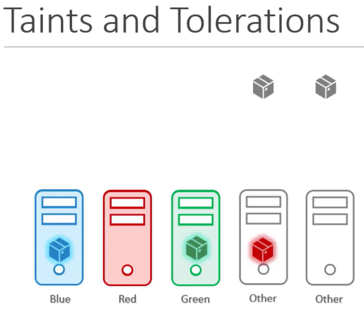
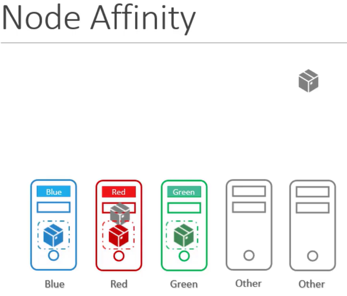
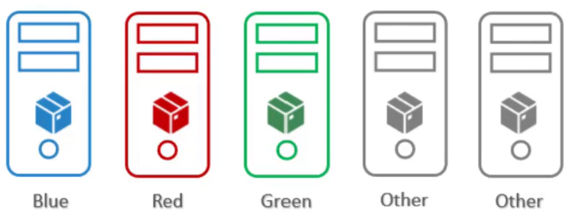

## **Taints & Tolerations vs Node Affinity in Kubernetes**


### Table of Contents

1. [Introduction](#introduction)
2. [Step 1: Using Taints & Tolerations Alone](#step-1-using-taints--tolerations-alone)
   - [What are Taints & Tolerations?](#what-are-taints--tolerations)
   - [How to Use Taints](#how-to-use-taints)
   - [How to Use Tolerations](#how-to-use-tolerations)
   - [Weakness](#weakness)
3. [Step 2: Using Node Affinity Alone](#step-2-using-node-affinity-alone)
   - [What is Node Affinity?](#what-is-node-affinity)
   - [How to Use Node Affinity](#how-to-use-node-affinity)
   - [Weakness](#weakness-1)
4. [Step 3: Combining Taints & Tolerations with Node Affinity](#step-3-combining-taints--tolerations-with-node-affinity)
   - [Why Combine Both?](#why-combine-both)
   - [How to Implement the Combination](#how-to-implement-the-combination)
   - [Result](#result)
5. [Conclusion](#conclusion)

---

### Introduction

In this tutorial, we’ll compare **Taints & Tolerations** with **Node Affinity** in Kubernetes by using an example scenario with 5 Pods (blue, red, green, and two grey) and 5 nodes (blue, red, green, and two grey). We’ll see how these mechanisms work individually, their weaknesses, and how combining them can give you the desired control over Pod scheduling.

[Back to TOC](#table-of-contents)

---

### Step 1: Using Taints & Tolerations Alone

#### What are Taints & Tolerations?

- **Taints** repel Pods from nodes that don't tolerate them. They are added to nodes.
- **Tolerations** are applied to Pods to allow them to schedule on nodes with matching taints.

[Back to TOC](#table-of-contents)

---

#### How to Use Taints

Taints are applied to nodes to repel any Pod that does not have the corresponding toleration. For example:

- Apply taints to the blue, red, and green nodes:
  
  ```bash
  kubectl taint nodes blue key=blue:NoSchedule
  kubectl taint nodes red key=red:NoSchedule
  kubectl taint nodes green key=green:NoSchedule
  ```

[Back to TOC](#table-of-contents)

---

#### How to Use Tolerations

Tolerations are applied to Pods so they can land on the nodes with the corresponding taints:

- Apply tolerations to the blue, red, and green Pods:
  
  - **Blue Pod**:
    ```yaml
    tolerations:
    - key: "blue"
      operator: "Exists"
      effect: "NoSchedule"
    ```
  - **Red Pod**:
    ```yaml
    tolerations:
    - key: "red"
      operator: "Exists"
      effect: "NoSchedule"
    ```
  - **Green Pod**:
    ```yaml
    tolerations:
    - key: "green"
      operator: "Exists"
      effect: "NoSchedule"
    ```

[Back to TOC](#table-of-contents)

---

#### Weakness

Using **Taints & Tolerations** alone will prevent Pods from landing on nodes they don't tolerate. However, because grey nodes have no taints, the blue, red, and green Pods could still be scheduled on grey nodes, which is not desired.

<div style="text-align: center;">
  
</div>


[Back to TOC](#table-of-contents)

---

### Step 2: Using Node Affinity Alone

#### What is Node Affinity?

**Node Affinity** allows Pods to be scheduled on specific nodes based on matching labels. Unlike taints, Node Affinity does not allow nodes to repel Pods; it only directs Pods to specific nodes.

[Back to TOC](#table-of-contents)

---

#### How to Use Node Affinity

Apply **Node Affinity** to the blue, red, and green Pods to ensure they are scheduled on their matching nodes:

- **Blue Pod**:
  ```yaml
  affinity:
    nodeAffinity:
      requiredDuringSchedulingIgnoredDuringExecution:
        nodeSelectorTerms:
        - matchExpressions:
          - key: color
            operator: In
            values:
            - blue
  ```

- Label the **blue**, **red**, and **green** nodes with matching labels:
  
  - Blue Node: `kubectl label node blue color=blue`
  - Red Node: `kubectl label node red color=red`
  - Green Node: `kubectl label node green color=green`

[Back to TOC](#table-of-contents)

---

#### Weakness

**Node Affinity** ensures that Pods are scheduled on nodes with matching labels. However, it does not prevent grey Pods from being scheduled on blue, red, or green nodes because nodes cannot repel Pods.

<div style="text-align: center;">
  
</div>


[Back to TOC](#table-of-contents)

---

### Step 3: Combining Taints & Tolerations with Node Affinity

#### Why Combine Both?

Using both **Taints & Tolerations** and **Node Affinity** ensures that:
- Blue, red, and green Pods land on their respective nodes.
- Grey Pods are prevented from being scheduled on blue, red, or green nodes.

[Back to TOC](#table-of-contents)

---

#### How to Implement the Combination

1. **Apply Taints** to blue, red, and green nodes:
   ```bash
   kubectl taint nodes blue key=blue:NoSchedule
   kubectl taint nodes red key=red:NoSchedule
   kubectl taint nodes green key=green:NoSchedule
   ```

2. **Add Tolerations** to blue, red, and green Pods:
   - **Blue Pod**:
     ```yaml
     tolerations:
     - key: "blue"
       operator: "Exists"
       effect: "NoSchedule"
     ```

3. **Apply Node Affinity** to blue, red, and green Pods:
   - **Blue Pod**:
     ```yaml
     affinity:
       nodeAffinity:
         requiredDuringSchedulingIgnoredDuringExecution:
           nodeSelectorTerms:
           - matchExpressions:
             - key: color
               operator: In
               values:
               - blue
     ```

4. **Leave Grey Pods Without Taints, Tolerations, or Node Affinity**:
   Grey Pods will only be scheduled on grey nodes.

[Back to TOC](#table-of-contents)

---

#### Result

- **Blue Pod** will go to the blue node and be repelled from all other nodes.
- **Red Pod** will go to the red node and be repelled from all other nodes.
- **Green Pod** will go to the green node and be repelled from all other nodes.
- **Grey Pods** will be scheduled only on grey nodes, as they have no affinity or tolerations.

 
<div style="text-align: center;">
  
</div>


[Back to TOC](#table-of-contents)

---

### Conclusion

Using **Taints & Tolerations** alone allows you to repel Pods from specific nodes, while **Node Affinity** ensures Pods are scheduled on matching nodes. By combining both, you achieve precise control over Pod scheduling, ensuring that Pods are scheduled on the desired nodes and repelled from the wrong ones.

[Back to TOC](#table-of-contents)

