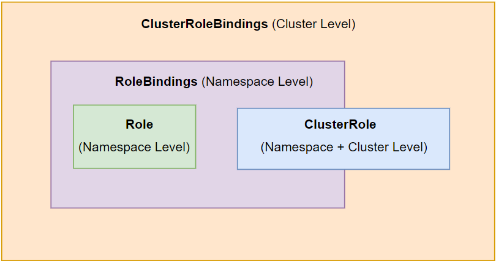

## Kubernetes Role-Based Access Control (RBAC) Tutorial

**Objective**: This tutorial aims to provide a comprehensive understanding of Role-Based Access Control (RBAC) in Kubernetes, including its configuration, use cases, and practical examples. By the end of this tutorial, you should be able to configure and manage RBAC for your Kubernetes clusters effectively.

### Table of Contents
1. [Introduction to RBAC](#1-introduction-to-rbac)
2. [Authorization Modes in Kubernetes](#2-authorization-modes-in-kubernetes)
3. [Core Components of RBAC](#3-core-components-of-rbac)
   - [Roles and ClusterRoles](#31-roles-and-clusterroles)
   - [RoleBindings and ClusterRoleBindings](#32-rolebindings-and-clusterrolebindings)
4. [Creating and Applying Roles and Bindings](#4-creating-and-applying-roles-and-bindings)
5. [Wildcard Usage in RBAC](#5-wildcard-usage-in-rbac)
6. [Validating RBAC Configurations](#6-validating-rbac-configurations)
7. [Best Practices for RBAC](#7-best-practices-for-rbac)
8. [Troubleshooting and Common Errors](#8-troubleshooting-and-common-errors)

---

### 1. [Introduction to RBAC](#1-introduction-to-rbac)

**RBAC** (Role-Based Access Control) in Kubernetes is a method for controlling access to the Kubernetes API based on the roles assigned to users or service accounts. Each role consists of rules that define the permissible actions on resources within the cluster.

[Back to TOC](#table-of-contents)

---

### 2. [Authorization Modes in Kubernetes](#2-authorization-modes-in-kubernetes)

Kubernetes supports several authorization modes, which determine how access is granted within the cluster:

- **AlwaysAllow**: Grants access to every request made to the API server. This mode is generally used in non-production environments or for auditing purposes.
- **AlwaysDeny**: Denies all requests, typically used for clusters that store sensitive information and need to ensure no unauthorized access.
- **RBAC**: This mode allows the use of RBAC for fine-grained control over who can do what within the cluster.
- **ABAC (Attribute-Based Access Control)**: This older method provides a more flexible but less structured approach than RBAC, where access is granted based on policies defined in a file.

#### Example of Configuring Authorization Mode

To configure the authorization mode in Kubernetes, you typically need to edit the API server configuration file located at `/etc/kubernetes/manifests/kube-apiserver.yaml`. This directory contains the key manifest files that define the Kubernetes control plane components, including `kube-apiserver`, `kube-controller-manager`, and `kube-scheduler`.

**Important Notes**:
- **Location**: The configuration files for the Kubernetes control plane are located in `/etc/kubernetes/manifests`.
- **Impact of Changes**: Making changes to any files in this directory will automatically trigger a reboot of the respective control plane component. This is because these files are monitored by the `kubelet`, and any updates cause the component to restart, applying the new configuration.
- **systemd Involvement**: These control plane components are managed as static pods by the `kubelet`. However, the underlying processes and services are also managed by `systemd`, which is responsible for starting the `kubelet` and ensuring it runs continuously. Any changes to the control plane files trigger actions managed by both the `kubelet` and `systemd`.

The relevant section of the `kube-apiserver.yaml` file might look like this:

```yaml
- --authorization-mode=Node,RBAC
```

In this example, `Node` and `RBAC` modes are enabled. The API server checks authorization using these modes in left-to-right order.

**Explanation of `authorization-mode=Node,RBAC`:**

- **Node**: This mode is used to authorize kubelets. It ensures that each node in the cluster has access only to the API resources necessary to manage its own workloads and nothing more.
- **RBAC**: Role-Based Access Control mode allows defining granular access controls for users and service accounts.

**Significance of Left-to-Right Evaluation**:

- The modes are evaluated in the order they are listed, from left to right. This means that when a request comes to the API server, it first checks the `Node` authorization mode. If the request is authorized by this mode, the API server does not evaluate the subsequent modes.
- If `Node` authorization does not allow the request, the server then checks `RBAC` to see if the request can be authorized. Other modes such as AlwaysDeny, or ABAC can be added to the authorization-mode separated by commas.

**Tweaking to Read Right-to-Left**:

- By default, Kubernetes processes the authorization modes from left to right, but with some custom configurations or by modifying the order in the `kube-apiserver.yaml`, it could potentially prioritize modes differently. However, this is not typical and should be approached with caution as it may lead to unexpected behavior.

[Back to TOC](#table-of-contents)

---

### 3. [Core Components of RBAC](#3-core-components-of-rbac)

RBAC in Kubernetes revolves around four main components:

#### 3.1. [Roles and ClusterRoles](#31-roles-and-clusterroles)

- **Roles**: Define permissions within a specific **namespace**.
- **ClusterRoles**: Define permissions **cluster-wide**.

#### 3.2. [RoleBindings and ClusterRoleBindings](#32-rolebindings-and-clusterrolebindings)

- **RoleBindings**: Grant the permissions defined in a Role to a user or service account within a **namespace**. Note that `RoleBinding` can only be used with a `Role`, and it does not work with a `ClusterRole`.

- **ClusterRoleBindings**: Grant the permissions defined in a `ClusterRole` to a user or service account across the **entire cluster**. Unlike `RoleBinding`, `ClusterRoleBinding` is versatile and can bind either a `ClusterRole` or a `Role` (effectively elevating the `Role`'s permissions to cluster-wide scope).

   <div style="text-align: center;">
     
   </div>

##### Example Role YAML

```yaml
apiVersion: rbac.authorization.k8s.io/v1
kind: Role
metadata:
  namespace: my-namespace
  name: pod-reader
rules:
- apiGroups: [""]
  resources: ["pods"]
  verbs: ["get", "watch", "list"]
```

In this example, the `Role` named `pod-reader` is defined to allow the `get`, `watch`, and `list` actions on `pods` within the `my-namespace`.

##### Example RoleBinding YAML

```yaml
apiVersion: rbac.authorization.k8s.io/v1
kind: RoleBinding
metadata:
  name: read-pods
  namespace: my-namespace
subjects:
- kind: User
  name: jane
  apiGroup: rbac.authorization.k8s.io
roleRef:
  kind: Role
  name: pod-reader
  apiGroup: rbac.authorization.k8s.io
```

The above `RoleBinding` grants the `pod-reader` role to a user named `jane` in the `my-namespace` namespace.

### Using `kubectl api-resources` Command

To explore and understand the resources available in your Kubernetes cluster, including those related to RBAC, you can use the `kubectl api-resources` command.

```bash
kubectl api-resources
```

This command lists all available resources in the cluster, showing details such as the resource name, API group, whether it is namespaced, and its kind. Below is a sample output specifically highlighting some RBAC-related resources and nodes:

```plaintext
NAME                     SHORTNAMES   APIGROUP                       NAMESPACED   KIND
roles                                 rbac.authorization.k8s.io      true         Role
rolebindings                          rbac.authorization.k8s.io      true         RoleBinding
clusterroles                          rbac.authorization.k8s.io      false        ClusterRole
clusterrolebindings                   rbac.authorization.k8s.io      false        ClusterRoleBinding
nodes                    no           <none>                         false        Node
```

**Explanation of the Output**:

- **roles**: This resource represents Roles, which are namespaced resources defined by the `rbac.authorization.k8s.io` API group.
- **rolebindings**: These are namespaced RoleBindings, which associate roles with users or service accounts.
- **clusterroles**: These are cluster-wide roles defined by the `rbac.authorization.k8s.io` API group.
- **clusterrolebindings**: These bind cluster-wide roles to users or service accounts across the entire cluster.
- **nodes**: Nodes represent the physical or virtual machines in the Kubernetes cluster.

### Sorting the Output Alphabetically

You can sort the output of `kubectl api-resources` in alphabetical order using the `--sort-by` flag. Here’s how you can do it:

```bash
kubectl api-resources --sort-by=name
```

This command will list the resources alphabetically by their names, making it easier to find specific resources.

[Back to TOC](#table-of-

contents)

---

### 4. [Creating and Applying Roles and Bindings](#4-creating-and-applying-roles-and-bindings)

Roles and bindings can be created and applied using `kubectl` commands or by applying YAML manifests. Here is how you can create a role and bind it:

```bash
kubectl apply -f role.yaml
kubectl apply -f rolebinding.yaml
```

To verify that the role and binding were created successfully, you can use:

```bash
kubectl get roles -n my-namespace
kubectl get rolebindings -n my-namespace
```

[Back to TOC](#table-of-contents)

---

### 5. [Wildcard Usage in RBAC](#5-wildcard-usage-in-rbac)

Wildcards can be used in RBAC to grant permissions broadly:

- `*` in the `resources` field grants permissions on all resources.
- `*` in the `verbs` field allows all actions (e.g., get, create, update).

**Example**: Granting a user full access to all resources:

```yaml
apiVersion: rbac.authorization.k8s.io/v1
kind: Role
metadata:
  namespace: my-namespace
  name: admin
rules:
- apiGroups: [""]
  resources: ["*"]
  verbs: ["*"]
```

[Back to TOC](#table-of-contents)

---

### 6. [Validating RBAC Configurations](#6-validating-rbac-configurations)

To validate whether a specific action is allowed under a given role, Kubernetes provides the `kubectl auth can-i` command.

**Example**:

```bash
kubectl auth can-i create pods --as=jane -n my-namespace
```

This command checks whether the user `jane` can create pods in the `my-namespace`.

[Back to TOC](#table-of-contents)

---

### 7. [Best Practices for RBAC](#7-best-practices-for-rbac)

- **Least Privilege**: Always assign the least privilege necessary. Use RoleBindings rather than ClusterRoleBindings where possible to limit the scope.
- **Namespace Isolation**: Use namespaces to isolate resources and permissions.
- **RoleBinding Over ClusterRoleBinding**: Prefer RoleBindings to limit permissions to a specific namespace rather than across the entire cluster.

[Back to TOC](#table-of-contents)

---

### 8. [Troubleshooting and Common Errors](#8-troubleshooting-and-common-errors)

- **401 Unauthorized**: This error indicates that the user is not authenticated.
- **403 Forbidden**: This indicates that the user is authenticated but does not have permission to perform the action.
- **Invalid Role or Binding**: Ensure that roles are created before bindings and that the role names and namespaces match.

**Example** of troubleshooting command:

```bash
kubectl describe rolebinding read-pods -n my-namespace
```

This command will show you the details of the RoleBinding, helping to identify any misconfigurations.

[Back to TOC](#table-of-contents)

